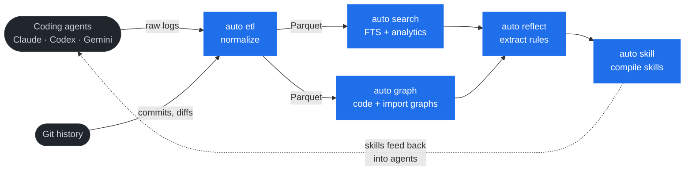
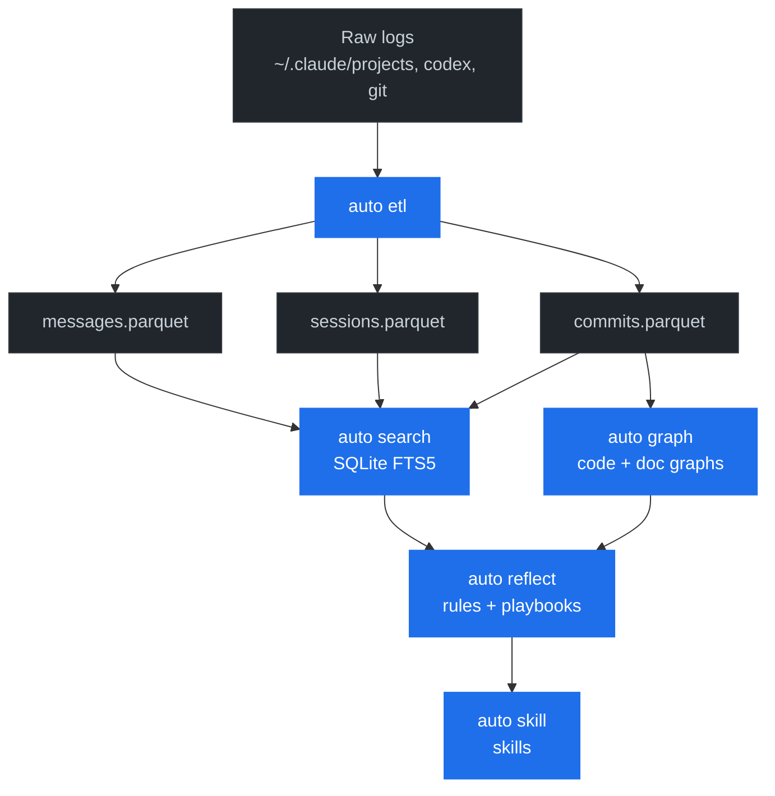

# Auto Stack

**Intelligence layer for AI coding agents.**

Auto Stack is a suite of CLI tools that capture, index, analyze, and learn from coding agent sessions. The tools form a feedback loop: your agents code, the stack watches, and the next session is smarter than the last.



---

## Install

```bash
curl -fsSL https://raw.githubusercontent.com/mistakenot/auto-stack/main/install.sh | bash
```

Custom install directory:

```bash
INSTALL_DIR=/usr/local/bin curl -fsSL https://raw.githubusercontent.com/mistakenot/auto-stack/main/install.sh | bash
```

The installer pulls the pre-built `auto` binary for `linux-amd64` and `darwin-arm64` from the latest [GitHub release](https://github.com/mistakenot/auto-stack/releases) — a single asset per platform. Building from source requires Go 1.26+.

`auto` ships with `update`:

```bash
auto update    # re-runs install.sh to pull the latest release
```

`auto update` is the canonical update path. The per-tool variants (`auto etl update`, `auto search update`, …) are equivalent aliases.

### Run `auto watch` in the background

No sudo required — install a per-user systemd unit that enables + starts on install:

```bash
auto watch daemon install     # writes ~/.config/systemd/user/autowatch.service, enables + starts it
```

`auto update` keeps the daemon current: it pulls the new binary and restarts an active user daemon for you.

For headless / multi-user hosts, opt into a system unit (requires root):

```bash
sudo "$(command -v auto)" watch daemon install --system
```

The user unit survives logout / starts at boot only after `loginctl enable-linger "$USER"` succeeds (install attempts this and warns if it can't — on a default host that may need a one-time `sudo loginctl enable-linger "$USER"`).

---

## The Tools

Roughly ordered by where each tool sits in the pipeline — raw inputs at the top, derived signals in the middle, orchestration and infra below.

| Tool | Status | What it does |
|------|--------|-------------|
| **auto etl** |  | Extracts session logs from Claude Code, Codex, and other agents — plus git history — into partitioned Parquet datasets. |
| **auto doc** |  | Documentation management with two-way freshness tracking, BM25 search, and `[autodoc()]` source-tag linking. |
| **auto graph** |  | File-level import graphs for TypeScript and Go. Doc-to-code overlays via `[autodoc()]` tags. Context-pack builder with token budgets. |
| **auto search** |  | SQLite FTS5 index over messages, sessions, and commits. Co-change queries, stats grouping, skill adoption tracking. |
| **auto reflect** |  | Capture session feedback, mine recurring patterns, and persist learned rules into project playbooks. |
| **auto skill** |  | Author, lint, and sync reusable agent skills. Detects skill bloat and validates trigger conditions. |
| **auto watch** |  | Cron-driven daemon that monitors repos and launches bash or Claude Code tasks on schedule or file events. |
| **auto env** |  | Template-based config generation with deterministic per-worktree port allocation. Stand up isolated dev envs for parallel agent branches. |
| **auto ui** |  | Local web dashboard over your session data — a single binary with an embedded no-build Preact SPA. `auto ui serve` runs it on localhost. |
| **auto config** |  | Validate and bootstrap agent configuration. Installs `prepare-commit-msg` hooks that link commits to sessions. |
| **autoeval** |  | Scenario-replay evaluation harness. Grade agents against ground truth and compare planning strategies. |
| **autoweb** |  | Safe web-research portal with pluggable backends (Exa, Parallel, OpenAI), dedupe, and Markdown conversion. |

---

## Quick Start: The Full Loop

The happy path from raw coding sessions to self-improving agents.

### 1. Capture session history

After coding with Claude Code, Codex, or other agents, extract and normalize the session logs:

```bash
auto etl run
```

This reads raw session logs (default: `~/.claude/projects`), normalizes them into Parquet datasets, and writes incremental output to `~/.auto/etl/output/`:

```
~/.auto/etl/output/
  messages/year=2026/week=15/messages.parquet
  sessions/year=2026/month=04/sessions.parquet
  commits/year=2026/month=04/commits.parquet
```

The same command also extracts git history (commits, diffs, branches, authors) so you can correlate code changes with the sessions that produced them.

### 2. Index for search

Build a full-text index over the normalized data:

```bash
auto search index
```

### 3. Search your history

```bash
# Find error patterns across all sessions
auto search search "Exit code 1" --since 1w

# Sessions that touched auth code
auto search search "auth middleware" --scope sessions

# Sessions where the agent burned tokens hitting bash errors
auto search session list --since 2w --min-errors 5 --sort-by errors

# Drill into a specific session, or list the worst ones
auto search session get $SESSION_ID
auto search session list --since 1w --min-tokens 50000 --sort-by tokens

# Filter by workspace
auto search search "flaky test" --cwd /home/dev/my-project

# Group results by tool to find which tools fire most often
auto search stats --group-by tool_name --since 1w

# Which skills are getting used (and which are dead weight)?
auto search skills --since 1w
```

All commands output JSON by default. Use `--highlight` to bold matching terms in snippets.

### 4. Correlate sessions with commits

Every commit produced inside a Claude Code session is linked back to that session via a `Session-Id:` trailer (installed by `auto config init`). You can drill from a commit to the agent transcript that produced it, or list every commit a given session shipped.

```bash
# Files that change together with auth.go over the last 90 days
auto search co-change auth.go --decay-tau 90d
```

`co-change` reads the commits dataset and surfaces implicit coupling — useful for refactor impact analysis and finding hidden dependencies that don't show up in import graphs. Results are ranked by directional confidence weighted by lift, with a large-commit penalty and configurable time decay. Output is budget-bounded compact text by default (`--budget` tunes the size); pass `--all` for every row or `--json` for the full envelope.

### 5. Map the code

```bash
# Build a file-level import graph for the current repo (TypeScript + Go)
auto graph code graph

# Assemble a context pack for an LLM, budgeted to N tokens
auto graph code context src/auth --file src/auth/login.ts --token-limit 8000
```

`auto graph` understands TypeScript (`tsconfig` path aliases, JSONC comments, dynamic `import()`, `require()`, re-exports) and Go (module-aware via `go.mod`). It also overlays `[autodoc()]` tags so you can see which docs cover which files.

### 6. Reflect and improve

```bash
# Record a rule for future sessions
auto reflect rule create \
  --use-when "writing new database queries" \
  --content "prefer sqlc over gorm for new queries" \
  --causal-note "gorm caused an N+1 on the dashboard query" \
  --domain db --type soft

# Run the retrieval loop: surface rules for a task, commit to an ordering,
# then close the loop with feedback (a gate blocks until feedback is submitted).
RT=$(auto reflect retrieve "database queries" --domain db | jq -r '.[0].retrieval_id')
FB=$(auto reflect select "$RT" | jq -r '.[0].feedback_id')
auto reflect feedback "{\"outcome\":\"success\",\"summary\":\"used sqlc\",\"rankings\":[{\"feedback_id\":\"$FB\",\"rank\":1,\"reason\":\"pointed me at sqlc\"}],\"gap\":null}"
auto reflect gate check
```

`auto reflect` persists rule memory as an event-sourced log, surfaces rules through a
retrieve/select/feedback loop, and feeds patterns back into project playbooks.
Run `auto reflect quickstart` for the full walkthrough.

### 7. Schedule the loop

`auto watch` runs the whole pipeline on a cadence — daily ETL, on-change indexing, weekly reflection runs:

```bash
# Define a task (bash or Claude Code prompt)
auto watch task create --id nightly-etl --bash "auto etl run && auto search index"

# Wire it to a cron trigger
auto watch trigger create --id daily-2am --cron "0 2 * * *"
auto watch trigger add-task daily-2am nightly-etl

# Or trigger on file events (glob-based, polled every 60s)
auto watch trigger create --id new-prs --type file_created --glob ".github/pull_requests/*.md"
auto watch trigger add-task new-prs review-pr

auto watch start
```

Triggers and tasks are defined separately and linked, so the same task can fan out across cron schedules and file-event watchers.

### 8. Self-improve (automated)

The self-improve pipeline ties it all together — it uses `auto search` to find problems in your coding sessions, analyzes them against your codebase, and opens PRs to fix the top issues:

```bash
prose run scripts/self-improve/index.md -- focus: "autosearch"
```

This runs a multi-agent pipeline:
1. **Preflight** — refreshes ETL and search index
2. **Explorer** — uses the tools as a real user, captures every friction point
3. **Analyst** — reads the codebase to find root causes
4. **Reviewer** — independently verifies the analysis
5. **Consolidator** — picks the top 3 improvements by impact-to-effort ratio
6. **Implementers** — 3 parallel agents, each on an isolated worktree, each opening a PR

The PR bodies capture the full workflow narrative (problem, plan, decisions, test results), which gets re-indexed by the next ETL run — closing the feedback loop.

---

## Feature Highlights

### Session ETL & analytics
- **Multi-source ETL** — Claude Code, Codex, and git history land in the same Parquet schema.
- **Incremental partitioning** — weekly partitions for messages, monthly for sessions and commits; re-runs are cheap.
- **Commit ↔ session linking** — `Session-Id:` git trailers (auto-installed) tie every commit to the agent transcript that produced it.
- **bash exit code parsing** — tool-result exit codes are extracted so you can find sessions where the agent looped on failing commands.
- **Per-tool-call timing** — `duration_ms`, `tool_use_id`, and an `interrupted` flag are captured per tool call, plus session-level turn-duration totals, so you can isolate slow calls and hangs.
- **Thinking & structured output** — assistant thinking blocks are preserved as `thinking` rows, and the full tool-result envelope is stored in `tool_use_result_json` for structured queries over deferred-tool results.
- **First-intent summaries** — each session records `first_user_intent`, the first meaningful user message after harness boilerplate is filtered out.

### Search & discovery
- **SQLite FTS5 + BM25** — sub-second full-text search over months of session history.
- **Rich filters** — `--since` / `--after` / `--before`, `--cwd`, `--remote`, `--role`, `--skill`, `--include-thinking`, plus message-level `--min-tool-duration` and `--interrupted` for hang diagnosis, session-level `--min-tokens`, `--min-messages`, `--min-errors`, `--min-duration`, `--no-subagent` / `--subagent`, `--parent-session`, and `--sort-by recency|duration|tool_duration|tokens|messages|errors`.
- **Co-change queries** — find files frequently edited together across git history.
- **Skill adoption tracking** — which skills are firing, which aren't, grouped by date and workspace.
- **Stats grouping** — group results by tool, file, session, skill, or workspace.

### Code context
- **TypeScript import graphs** — ast-grep-powered, handles static/dynamic imports, `require()`, re-exports, and `tsconfig` path aliases (with wildcard prefix+suffix, baseUrl probing, JSONC tolerance).
- **Go import graphs** — native `go/parser` walk, module-aware via `go.mod`.
- **Context packs** — deterministic, token-budgeted code bundles for LLM analysis.
- **Doc-code overlay** — `auto graph` and `auto doc graph` visualize which docs cover which files via `[autodoc()]` tags.

### Documentation
- **Two-way freshness links** — `[autodoc()]` tags in source code and content hashes in doc frontmatter detect drift in both directions.
- **BM25 doc search** — `auto doc search keyword <query>` searches every doc in the tree.
- **`read_when` routing hints** — frontmatter tells agents when to pull a doc into context.
- **Auto-generated indexes** — `auto doc fix` regenerates the documentation index in CLAUDE.md / AGENTS.md.

### Worktree environments
- **Deterministic ports** — CRC32-hashed per-worktree port allocation; no collisions when running multiple agent branches in parallel.
- **Template-driven configs** — render `.env`, `process-compose.yaml`, etc. with per-worktree variables.
- **Central registry** — `~/.auto/env/environments.json` (flock-protected) tracks every active worktree env for status and cleanup from anywhere.

### Skills, watch, reflect
- **Skill linting & sync** — validate trigger metadata, schema, descriptions, total token cost.
- **File-event triggers** — `auto watch` supports `file_created` with glob patterns alongside cron.
- **Rule memory** — `auto reflect` persists learned rules with `--effective-at` timestamps for time-travel queries.

---

## Data Architecture

All tools share a common data format and communicate through files, not APIs.



The canonical schema is defined in `auto-etl/internal/model/model.go`. The three datasets:

- **messages** — one row per message. Role, content (inline), tool name, file paths, token counts, timestamps, bash exit codes.
- **sessions** — one row per session. Workspace, git remote, model, token totals, full and truncated transcripts, subagent flag.
- **commits** — one row per commit. SHA, author, message, branch, file diffs, parent SHA, `Session-Id` if present.

Parquet is columnar, so wide content columns don't slow down metadata queries. You can also query the files directly with DuckDB:

```bash
# Most-edited files across all sessions
duckdb -c "
  SELECT tool_file_path, count(*) AS edits
  FROM '~/.auto/etl/output/messages/**/*.parquet'
  WHERE tool_name = 'Write'
  GROUP BY tool_file_path
  ORDER BY edits DESC
  LIMIT 20
"

# Token usage by top-level (non-subagent) session
duckdb -c "
  SELECT workspace, total_tokens,
    epoch_ms(first_message_at) AS started
  FROM '~/.auto/etl/output/sessions/**/*.parquet'
  WHERE is_subagent = false
  ORDER BY total_tokens DESC
  LIMIT 10
"

# Commits per session (which session shipped the most code?)
duckdb -c "
  SELECT session_id, count(*) AS commits, sum(insertions) AS lines_added
  FROM '~/.auto/etl/output/commits/**/*.parquet'
  WHERE session_id IS NOT NULL
  GROUP BY session_id
  ORDER BY lines_added DESC
  LIMIT 10
"
```

---

## Configuration

Global config lives in `~/.auto/`. Each tool has its own subdirectory:

```
~/.auto/
  settings.json          # shared host-level defaults (hostname, host_id)
  etl/                   # raw session copies + Parquet output
  search/                # SQLite FTS indexes
  graph/                 # cached code graphs
  docs/                  # auto doc settings
  watch/                 # auto watch schedules + state.sqlite
  reflect/               # rule memory
  env/                   # environments.json registry
```

Project-local config lives in `.auto/` within your repo. Both layers support `init` and `init --project`.

Most commands default to JSON for machine consumption. Date filters are uniform across tools that support time-based queries:

```bash
--since 5m             # last 5 minutes
--since 5d             # last 5 days
--since 1w             # last 1 week
--after 2026-01-01 --before 2026-02-01
```

---

## Development

```bash
git clone https://github.com/mistakenot/auto-stack.git
cd auto-stack
make install-hooks   # pre-commit hooks (gofmt, go vet, auto doc, beads sync)
make install-tools   # golangci-lint, ast-grep, etc.
make build           # build the auto binary to ./bin/
make install         # build and install to ~/.local/bin/
make test            # run all tests
make check           # fmt-check + vet + lint + test
```

Each sub-project is an independent Go module with its own `go.mod`, sharing common utilities via the `auto-shared` module. See each sub-project's `CLAUDE.md` for build and test specifics.

Releases are cut by tagging a commit; the `release` GitHub Actions workflow builds the `auto` binary for `linux-amd64` and `darwin-arm64` and publishes them. See [SECURITY.md](SECURITY.md) for vulnerability reporting.

---

## License

Private repository. All rights reserved.
