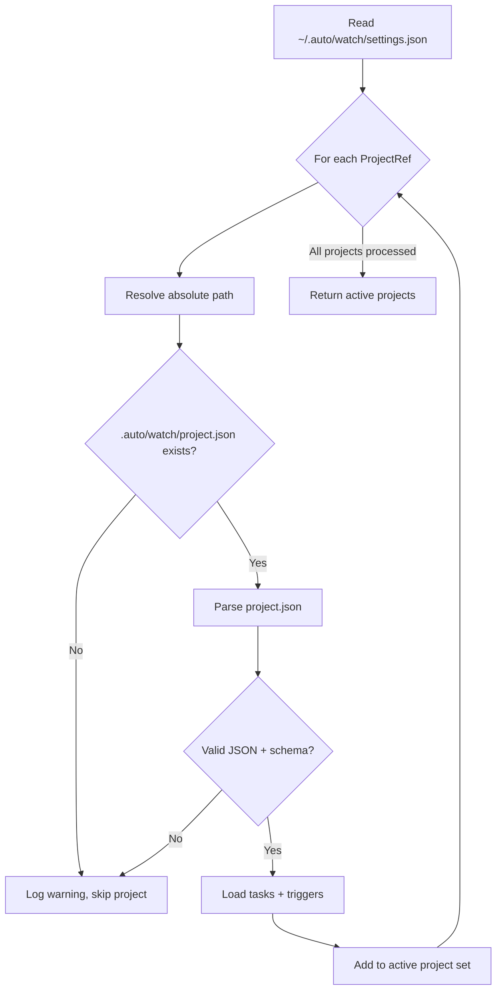
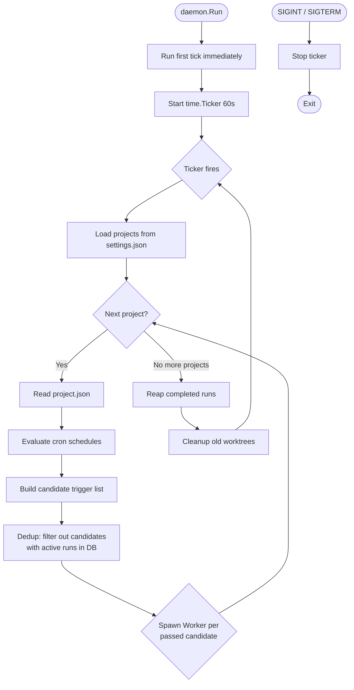
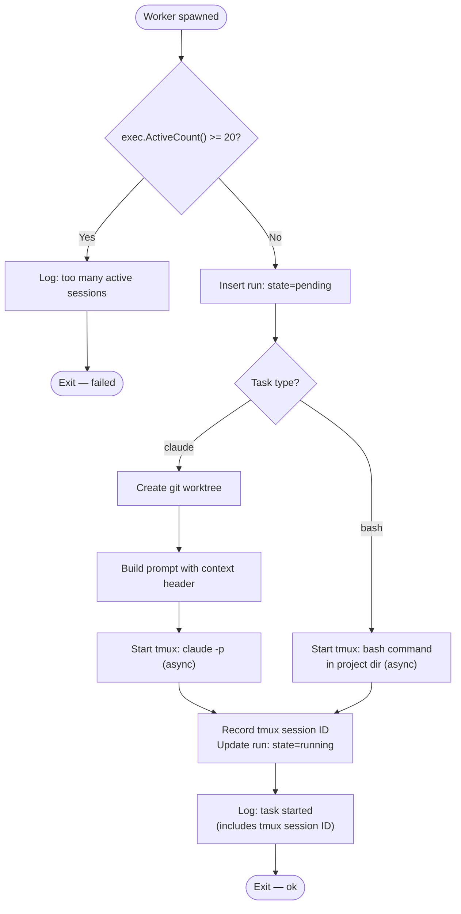
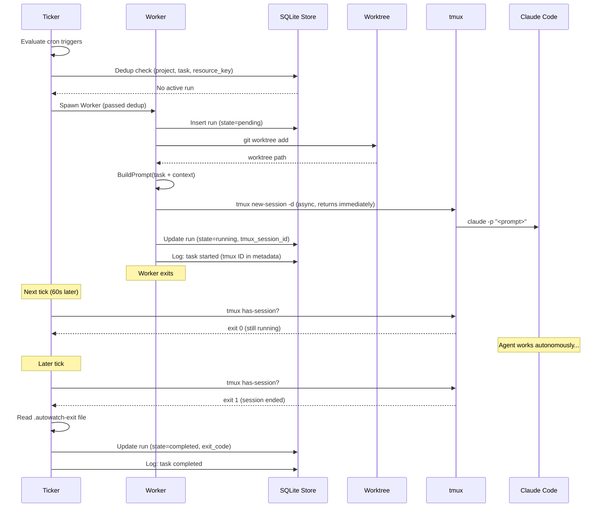
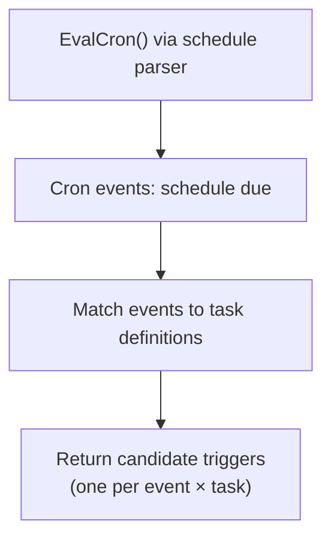
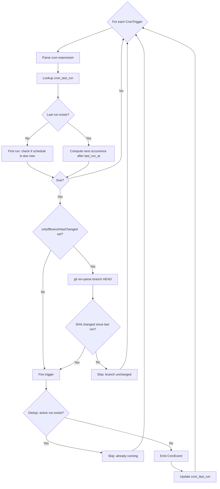
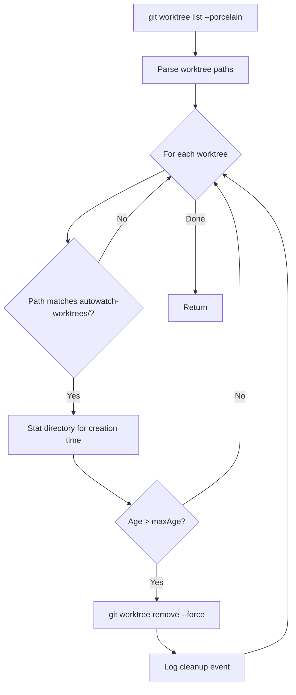
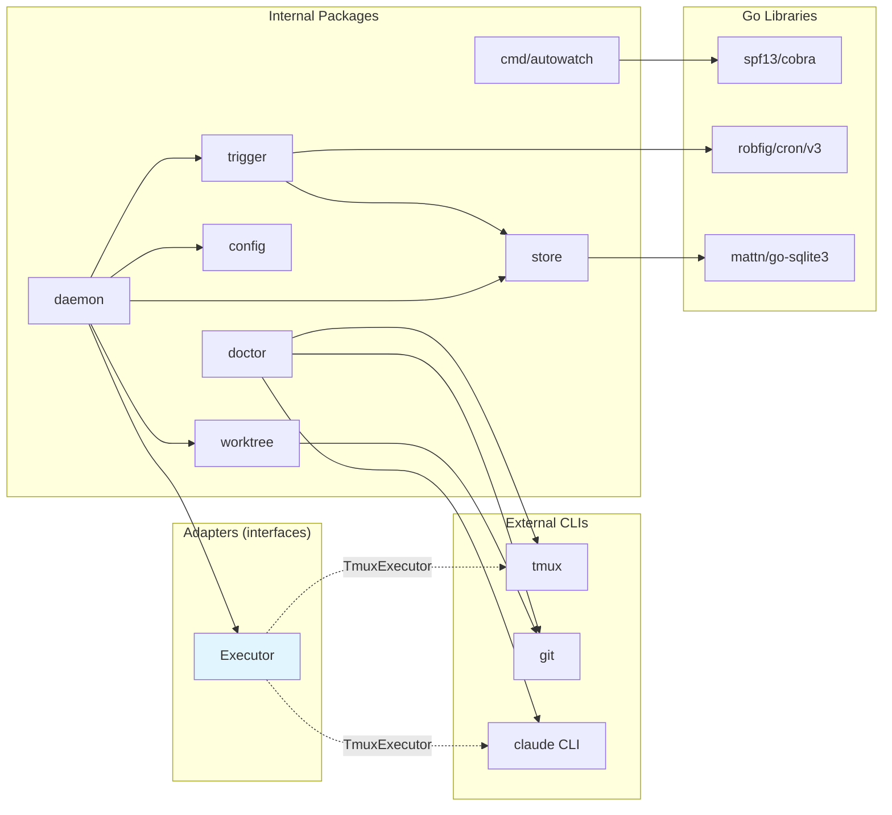

# autowatch — Technical Solution

This document describes the implementation plan for autowatch v1. Read alongside [requirements.md](requirements.md) for the full product spec.

---

## 1. Project Structure

```
auto-watch/
├── cmd/autowatch/
│   └── main.go                  # Cobra root + subcommands
├── internal/
│   ├── config/
│   │   ├── global.go            # ~/.auto/watch/settings.json
│   │   └── project.go           # .auto/watch/project.json
│   ├── trigger/
│   │   ├── cron.go              # Cron schedule evaluation
│   │   └── types.go             # Trigger types and shared types
│   ├── executor/
│   │   ├── executor.go          # Executor interface
│   │   ├── tmux.go              # tmux-backed implementation (TmuxExecutor)
│   │   └── mock.go              # MockExecutor for testing
│   ├── worktree/
│   │   └── worktree.go          # Git worktree create/cleanup
│   ├── store/
│   │   └── store.go             # SQLite event log + state
│   ├── daemon/
│   │   ├── loop.go              # Main tick loop (Ticker)
│   │   ├── worker.go            # Worker goroutine
│   │   └── prompt.go            # Prompt construction
│   └── doctor/
│       └── doctor.go            # Prerequisite checks
├── docs/
│   ├── requirements.md
│   ├── solution.md
│   └── future-concerns.md
├── CLAUDE.md
├── go.mod
└── go.sum
```

All packages are `internal/` — no exported API surface.

### Adapter Architecture

The system uses interface-based adapters for external dependencies so that each component can be tested in isolation:

| Interface | Production impl | Mock impl | External dependency |
|-----------|----------------|-----------|---------------------|
| `Executor` | `TmuxExecutor` (shells out to `tmux`) | `MockExecutor` (in-memory state) | tmux |

The Ticker and Workers accept these interfaces — they never call `tmux` directly. This means:

- **Unit tests** swap in mocks to test trigger evaluation, dedup logic, and Worker behavior without any external processes.
- **Integration tests** can mix real and mock adapters (e.g. real SQLite + mock executor).
- **E2E tests** use the real adapters with actual `tmux` binaries.

---

## 2. Core Flow Diagrams

### 2.1 Project Discovery

How the daemon discovers and loads project configurations each tick.



### 2.2 Ticker

The top-level process. Woken every 60s by `time.Ticker`. The Ticker always runs — it does the fast, synchronous work (load projects, evaluate cron, dedup check, save state to DB) and then spawns **Workers** only for triggers that pass dedup. The Ticker itself never blocks.

> **Review comment (P2):** "Ticker itself never blocks" is too absolute. `git`, filesystem, and SQLite calls can block or stall, so this statement can mislead runtime expectations.



### 2.3 Worker

A short-lived goroutine spawned by the Ticker after dedup has already passed. Handles worktree setup (claude tasks) or direct execution (bash tasks).



### 2.4 Worker Lifecycle (across Ticker ticks)

Shows how a Worker fires a tmux session and subsequent Ticker ticks reap the result.



### 2.5 Trigger Detection (Ticker phase)

The Ticker's synchronous trigger detection phase. Evaluates cron schedules, saves results to DB, builds the candidate list that Workers will act on.



### 2.6 Cron Trigger Evaluation

How cron schedules are evaluated each tick.



### 2.7 Worktree Cleanup

Cleanup runs at the end of each tick and via `autowatch clean`.



### 2.8 Dependency Map

Shows all third-party dependencies and which internal packages use them. Adapters isolate external CLI tools so the core logic is testable without them.



Dashed lines show production adapter implementations. In tests, `MockExecutor` replaces these — no external CLIs needed.

---

## 3. Data Model

### 3.1 Config Types

#### Global config (`~/.auto/watch/settings.json`)

```go
// internal/config/global.go

type GlobalConfig struct {
    Projects []ProjectRef `json:"projects"`
}

type ProjectRef struct {
    Path   string `json:"path"`   // absolute path to repo root
    Remote string `json:"remote"` // git remote URL (captured at add time)
}
```

#### Project config (`.auto/watch/project.json`)

```go
// internal/config/project.go

type ProjectConfig struct {
    ID       string                  `json:"id"`
    Tasks    map[string]TaskDef      `json:"tasks"`
    Triggers map[string]TriggerDef   `json:"triggers"`
}

// TaskDef represents a task definition. Exactly one of Command or Prompt must be set.
type TaskDef struct {
    Type    string `json:"type"`              // "bash" or "claude"
    Command string `json:"command,omitempty"` // shell command (bash tasks)
    Prompt  string `json:"prompt,omitempty"`  // Claude Code prompt (claude tasks)
}

// TriggerDef represents a trigger definition.
type TriggerDef struct {
    Type                 string   `json:"type"`                            // "cron" or "github_pr"
    When                 string   `json:"when,omitempty"`                  // cron expression (cron triggers)
    Tasks                []string `json:"tasks"`                           // task IDs to launch
    OnlyIfBranchChanged  string   `json:"onlyIfBranchHasChanged,omitempty"` // branch name (cron only)
}
```

### 3.2 Store Types

```go
// internal/store/store.go

type RunState string

const (
    RunPending   RunState = "pending"
    RunRunning   RunState = "running"
    RunCompleted RunState = "completed"
    RunFailed    RunState = "failed"
)

// Run tracks a single task execution.
type Run struct {
    ID           int64
    ProjectID    string
    TaskID       string
    ResourceKey  string    // dedup key: e.g. "pr:5", "cron:0 9 * * 1"
    TriggerType  string    // "cron"
    State        RunState
    TmuxSession  string    // tmux session name
    WorktreePath string
    Branch       string    // default branch for cron
    StartedAt    time.Time
    CompletedAt  *time.Time
    ExitCode     *int
    LastOutput   string    // last N lines of agent output, captured from tmux pane
    Error        string
}

// CronLastRun tracks when each cron trigger last fired.
// Keyed by (project_id, trigger_id) to avoid collisions when multiple triggers share the same schedule.
type CronLastRun struct {
    ProjectID     string
    TriggerID     string    // trigger ID from project config
    LastRunAt     time.Time
    LastBranchSHA string    // HEAD SHA at last run, for onlyIfBranchHasChanged
}
```

---

## 4. SQLite Schema

Single file at `~/.auto/watch/logs.sqlite`.

```sql
CREATE TABLE IF NOT EXISTS runs (
    id            INTEGER PRIMARY KEY AUTOINCREMENT,
    project_id    TEXT NOT NULL,
    task_id       TEXT NOT NULL,
    resource_key  TEXT NOT NULL,
    trigger_type  TEXT NOT NULL,
    state         TEXT NOT NULL DEFAULT 'pending',
    tmux_session  TEXT,
    worktree_path TEXT,
    branch        TEXT,
    started_at    DATETIME NOT NULL DEFAULT CURRENT_TIMESTAMP,
    completed_at  DATETIME,
    exit_code     INTEGER,
    last_output   TEXT,             -- last N lines of agent output from tmux pane
    error         TEXT
);

CREATE INDEX IF NOT EXISTS idx_runs_dedup
    ON runs (project_id, task_id, resource_key, state);

CREATE INDEX IF NOT EXISTS idx_runs_state
    ON runs (state);

CREATE TABLE IF NOT EXISTS cron_last_run (
    project_id      TEXT NOT NULL,
    trigger_id      TEXT NOT NULL,
    last_run_at     DATETIME NOT NULL,
    last_branch_sha TEXT,            -- HEAD SHA at last run, for onlyIfBranchHasChanged
    PRIMARY KEY (project_id, trigger_id)
);

CREATE TABLE IF NOT EXISTS events (
    id         INTEGER PRIMARY KEY AUTOINCREMENT,
    timestamp  DATETIME NOT NULL DEFAULT CURRENT_TIMESTAMP,
    level      TEXT NOT NULL,       -- info, warn, error
    category   TEXT NOT NULL,       -- trigger, task, worktree, system
    project_id TEXT,
    task_id    TEXT,
    message    TEXT NOT NULL,
    metadata   TEXT                 -- JSON blob for structured context
);

CREATE INDEX IF NOT EXISTS idx_events_time
    ON events (timestamp);
```

The `runs` table is the operational table — dedup checks, status tracking. The `events` table is the audit log for `autowatch logs`.

---

## 5. Trigger Detection

### 5.1 Cron Trigger

```go
// internal/trigger/cron.go

// EvalCron checks which cron triggers are due and returns tasks to launch.
func EvalCron(triggers map[string]config.TriggerDef, store *store.Store, projectID string, projectPath string) ([]CronEvent, error)
```

**Algorithm:**

1. For each cron trigger:
   - Parse the `when` field using a cron parser (e.g. `github.com/robfig/cron/v3`).
   - Look up `cron_last_run` for `(project_id, trigger_id)`.
   - If no entry → trigger has never fired. If the schedule is due now (current time matches or has passed the next occurrence after epoch), fire it.
   - If entry exists → compute next occurrence after `last_run_at`. If `time.Now()` is past that, fire.
   - **No catch-up:** If daemon was down and multiple firings were missed, only fire once (the current one). Update `last_run_at` to now.

> **Review comment (P2):** Timezone semantics are still implicit here. Without an explicit timezone policy, DST and cross-host behavior become unpredictable and hard to debug.
2. For triggers with `onlyIfBranchHasChanged`:
   - Run `git -C <projectPath> rev-parse <branch>` to get current HEAD SHA.
   - Read `last_branch_sha` from `cron_last_run` for this `(project_id, trigger_id)`.
   - If `last_branch_sha` is NULL (first run) → the branch is considered "changed", so the trigger fires.
   - If `last_branch_sha` matches current SHA → branch hasn't changed since last run. Skip this trigger even if the cron schedule is due.
   - If `last_branch_sha` differs → branch has new commits. Allow the trigger to fire.
   - **Use case:** Weekly reflection tasks that should only run if there's been new work on `main`. Avoids wasting agent time re-analyzing the same code.
3. Update `cron_last_run` with current time and current branch SHA. Always written — even when the trigger is due but dedup blocks the launch. This prevents a burst of queued-up runs when the active run completes, and keeps `last_branch_sha` tracking the latest observed state.

```go
type CronEvent struct {
    TriggerID string
    Schedule  string
    Tasks     []string
    Branch    string // default branch unless overridden
}
```

**Dedup:** Check `runs` for active run with `resource_key = fmt.Sprintf("cron:%s", triggerID)`.

---

## 6. Executor Adapter

The `Executor` interface abstracts how tasks are run. The Ticker, Workers, and all test code interact only with this interface — never with tmux directly.

```go
// internal/executor/executor.go

// Executor manages task lifecycle in an isolated environment.
type Executor interface {
    // Start launches a task. Returns a session ID for tracking.
    Start(opts StartOpts) (sessionID string, err error)

    // IsRunning checks if a session is still active.
    IsRunning(sessionID string) (bool, error)

    // Result returns the exit status and last output of a completed session.
    Result(sessionID string) (ResultInfo, error)

    // Kill terminates a running session.
    Kill(sessionID string) error

    // ActiveCount returns the number of currently active sessions.
    ActiveCount() (int, error)
}

type ResultInfo struct {
    ExitCode   int
    LastOutput string // last N lines of agent output captured from the session
}

type StartOpts struct {
    WorkDir     string // worktree path (claude tasks) or project dir (bash tasks)
    Command     string // shell command to execute (bash tasks) or empty (claude tasks)
    Prompt      string // full prompt with context header (claude tasks) or empty (bash tasks)
    SessionName string // unique tmux session name
}
```

> **Review comment (P0):** This interface conflicts with the exit-file design below. `IsRunning(sessionID)` and `Result(sessionID)` don't receive `workdir`, but `.autowatch-exit` is per-workdir and not derivable reliably after daemon restart, which breaks recovery semantics.

### 6.1 tmux Implementation (`TmuxExecutor`)

**Completion source of truth:** The exit-code file (`<workdir>/.autowatch-exit`). This is the single authoritative signal that a task has finished. The `remain-on-exit` tmux option keeps the pane alive after the process exits so output can be captured. The lifecycle is:

1. **Start** → tmux session created, `remain-on-exit on` set
2. **Process exits** → claude writes exit code to `.autowatch-exit`, pane stays alive
3. **IsRunning** → checks for `.autowatch-exit` file (not `tmux has-session`)
4. **Result** → reads exit code file, captures pane scrollback, kills tmux session
5. **Run closed** → Ticker updates run to `completed`/`failed`

```go
// internal/executor/tmux.go

type TmuxExecutor struct{}
```

**Start:**

1. Generate session name: `autowatch-<projectID>-<taskID>-<timestamp>`.
2. Build command based on task type:
   - **Claude tasks:** `claude --dangerously-skip-permissions -p "<prompt>"`. Prompt is written to a temp file and passed via `cat` to avoid shell quoting issues.
   - **Bash tasks:** the command string from the task definition.
3. Create tmux session with `remain-on-exit on` so the pane survives after the process exits:
   ```
   tmux new-session -d -s <name> -c <workdir> '<command>; echo $? > <workdir>/.autowatch-exit'
   tmux set-option -t <name> remain-on-exit on
   ```
4. Return session name.

**IsRunning:**

1. Check if the exit code file exists: `<workdir>/.autowatch-exit`.
2. If it doesn't exist → still running. If it exists → process has exited (the tmux pane remains alive due to `remain-on-exit`).

**Result:**

1. Read exit code from `<workdir>/.autowatch-exit`.
2. Capture the last 50 lines of agent output from the tmux pane:
   ```
   tmux capture-pane -t <name> -p -S -50
   ```
   This reads the pane's scrollback buffer — works because `remain-on-exit on` keeps the pane alive after the process exits.
3. Kill the tmux session now that output has been captured: `tmux kill-session -t <name>`.
4. Return `ResultInfo{ExitCode, LastOutput}`.

**Kill:**

1. `tmux kill-session -t <name>`.

**ActiveCount:**

1. `tmux list-sessions 2>/dev/null | wc -l`. Returns 0 if tmux server is not running.

### 6.2 Mock Implementation (`MockExecutor`)

```go
// internal/executor/mock.go

type MockSession struct {
    Opts     StartOpts
    Running  bool
    Result   ResultInfo
}

type MockExecutor struct {
    Sessions map[string]*MockSession // keyed by session ID
    StartErr error                   // optional error to simulate start failures
    mu       sync.Mutex
}

func (m *MockExecutor) Start(opts StartOpts) (string, error) {
    // Records the start call, adds to Sessions map with Running=true
}

func (m *MockExecutor) IsRunning(id string) (bool, error) {
    // Returns Sessions[id].Running
}

func (m *MockExecutor) Result(id string) (ResultInfo, error) {
    // Returns Sessions[id].Result
}

func (m *MockExecutor) Kill(id string) error {
    // Sets Sessions[id].Running = false
}

func (m *MockExecutor) ActiveCount() (int, error) {
    // Counts sessions where Running == true
}

// Test helper: simulate a session completing
func (m *MockExecutor) CompleteSession(id string, exitCode int, output string)
```

The `MockExecutor` tracks all sessions in memory. Tests can call `CompleteSession()` to simulate a task finishing, then verify that the Ticker's reap phase picks it up correctly.

---

## 7. Worktree Management

**v1 scope:** Cron triggers only. Worktrees are created from the default branch. PR-triggered worktrees (checking out PR head branches) are deferred to v2.

```go
// internal/worktree/worktree.go

// Create makes a new git worktree for a task run.
func Create(repoPath string, branch string, runID int64) (worktreePath string, err error)

// Cleanup removes worktrees older than maxAge.
func Cleanup(repoPath string, maxAge time.Duration) error

// Remove deletes a specific worktree.
func Remove(worktreePath string) error
```

**Create:**

1. Worktree path: `<repoPath>/.git/autowatch-worktrees/<runID>`.
2. `git worktree add <path> <branch>` (default branch, typically `main`).
4. Return the worktree path.

> **Review comment (P1):** Using a path under `.git/` for worktrees is risky and can fail depending on git/worktree constraints, which threatens launch reliability.

**Cleanup:**

1. List worktrees via `git worktree list --porcelain`.
2. Parse paths that match the `autowatch-worktrees/` prefix.
3. For each, check creation time (stat the directory). If older than `maxAge` (24h), run `git worktree remove --force <path>`.

---

## 8. Prompt Construction

When launching a task, the prompt from `project.json` is augmented with a context header:

```go
// internal/daemon/prompt.go

func BuildPrompt(task TaskDef, ctx PromptContext) string

type PromptContext struct {
    ProjectID    string
    TriggerType  string   // "cron" (v1); "github_pr" in v2
    TriggerID    string   // trigger ID from project config
    ResourceKey  string
    Branch       string
}
```

**Output format:**

```
<autowatch-context>
PROJECT_ID: my-project
TRIGGER_TYPE: cron
TRIGGER_ID: daily
RESOURCE_KEY: cron:daily
BRANCH: main
</autowatch-context>

/regression-review on commits from last 24 hours
```

The XML-style block is easily parseable by the agent and won't be confused with user content. Only claude tasks get prompt construction — bash tasks run their command directly.

---

## 9. Main Daemon Loop

### Domain Language

| Term | Definition |
|------|-----------|
| **Ticker** | The top-level process, woken every 60s. Loads projects, evaluates cron, saves state to DB, performs dedup checks, and spawns Workers only for triggers that pass dedup. Always runs synchronously — never needs to check if a previous Ticker is still running because its work is fast and bounded. |
| **Worker** | A short-lived goroutine spawned by the Ticker for a trigger that has already passed dedup. Handles worktree creation, prompt building, and tmux launch. Exits quickly with a logged result. |
| **Candidate trigger** | A `(project, task, trigger event)` tuple that the Ticker has identified as needing a task launch. The Ticker filters these through dedup before spawning Workers. |
| **Run** | A row in the `runs` table tracking a single task execution from pending through completed/failed. |

### 9.1 Ticker

```go
// internal/daemon/loop.go

func Run(cfg config.GlobalConfig, db *store.Store, exec executor.Executor) error
```

The Ticker is the top-level loop. It uses `time.NewTicker(60 * time.Second)` to wake every 60s on the wall clock. The first tick runs immediately on daemon start.

```go
func Run(...) error {
    ticker := time.NewTicker(60 * time.Second)

    // Run first tick immediately
    tick(...)

    for {
        select {
        case <-ticker.C:
            tick(...)
        case <-shutdownCh:
            ticker.Stop()
            return nil
        }
    }
}
```

**Each tick does:**

1. **Load projects:** Reread `~/.auto/watch/settings.json`.
2. **For each project:**
   a. Read `.auto/watch/project.json`. If missing or invalid, log warning, skip.
   b. **Evaluate cron:** Call `EvalCron()` — checks schedules against `cron_last_run`, returns due triggers.
   c. **Build candidates:** Match events to task definitions in project config. Each `(event, task)` pair becomes a candidate trigger.
   d. **Dedup:** For each candidate, query `runs` for an active run (state `pending` or `running`) matching `(project_id, task_id, resource_key)`. If found, log skip and drop the candidate. This runs synchronously in the Ticker — single-threaded, no race conditions.
   e. **Spawn Workers:** For each candidate that passed dedup, `go runWorker(candidate)`.
3. **Reap completed runs:** Query `runs` where `state = 'running'`. For each, call `executor.IsRunning()` (non-blocking `tmux has-session`). If exited, read exit code, update run to `completed` or `failed`, log.
4. **Worktree cleanup:** Call `worktree.Cleanup()` with 24h max age.

> **Review comment (P0):** This directly conflicts with section 6.1, which declares `.autowatch-exit` as the completion source of truth (not `tmux has-session`), so completion behavior is internally inconsistent.

The Ticker's own work is fast — DB reads/writes, cron evaluation, spawning goroutines. It always completes well within 60s. Workers run concurrently but are also short-lived (create worktree + start tmux + exit).

### 9.2 Worker

```go
// internal/daemon/worker.go

func runWorker(candidate CandidateTrigger, db *store.Store, exec executor.Executor) {
    // 1. Sanity check
    // 2. Create worktree + launch tmux
    // 3. Log result
}
```

A Worker is spawned only for candidates that have already passed the Ticker's dedup check. It launches the task:

1. **Sanity check:** Call `exec.ActiveCount()`. If ≥ 20, log `"error: too many active sessions (N), refusing to launch"`, mark run as `failed`, exit. This prevents runaway session accumulation from misconfigured triggers or stuck sessions.
2. Insert `Run` record with state `pending`.
3. **For claude tasks:** Create git worktree, build prompt with context header.
4. **For bash tasks:** Use project directory as workdir, no worktree.
5. Call `executor.Start()` — creates tmux session, returns immediately with session ID.
6. Update run to `running` with tmux session ID and worktree path (if any).
7. Log `"task started (tmux_session=<id>, worktree=<path>)"`, exit.

> **Review comment (P0):** Step ordering is inconsistent: step 1 says "mark run failed" before a run row exists (the insert is step 2), so the failure path is not implementable as written.

The Worker never waits for the Claude Code session to finish. It fires the tmux session and exits. The Ticker's reap phase on subsequent ticks detects when sessions complete.

**Graceful shutdown:** On SIGINT/SIGTERM, the Ticker stops. Running tmux sessions are left alive — they are independent OS processes. Workers that are mid-flight complete their current operation (worktree creation or tmux start) before the process exits.

---

## 10. CLI Commands

All commands use Cobra. Root command is `autowatch`.

### 10.1 `autowatch init`

Does both global and project setup in one command:

1. **Global setup** (if `~/.auto/watch/settings.json` doesn't exist):
   - Create `~/.auto/` and `~/.auto/watch/` if not exists.
   - Create `~/.auto/watch/settings.json` with `{"projects": []}`.
   - Create or verify `~/.auto/host.json` with hostname.
2. **Project setup** (if cwd is a git repo):
   - Create `.auto/watch/project.json` with `{"id": "<folder-name>", "tasks": {}, "triggers": {}}` if not exists.
   - Get remote URL (`git remote get-url origin`).
   - Register project in `settings.json` (append `ProjectRef` with path and remote) if not already registered.
3. If cwd is not a git repo, only global setup runs. Print message explaining project setup was skipped.

### 10.2 `autowatch task create`

1. Read `.auto/watch/project.json`. Fail if it doesn't exist (run `init` first).
2. Parse flags: `--id` (required), exactly one of `--bash <command>` or `--claude <prompt>`.
3. Create `TaskDef` with appropriate type and command/prompt.
4. Write to `tasks[id]` in project config (overwrites if exists).
5. Write updated config back to disk.

### 10.3 `autowatch task run`

1. Read `.auto/watch/project.json`. Look up task by `--id`.
2. For `bash` tasks: execute command via `os/exec` in project directory, stream stdout/stderr, block until complete, exit with command's exit code.
3. For `claude` tasks: create a git worktree from default branch, start Claude Code with the prompt in the worktree, block until complete, clean up worktree.

### 10.4 `autowatch task list`

1. Read `.auto/watch/project.json`.
2. Print all tasks with ID, type, and command/prompt preview.

### 10.5 `autowatch task remove`

1. Read `.auto/watch/project.json`.
2. Remove task by `--id`. Warn if any triggers still reference it (but still remove).
3. Write updated config.

### 10.6 `autowatch trigger create`

1. Read `.auto/watch/project.json`.
2. Parse flags: `--id` (required), `--cron <expr>` (required). Optional `--only-if-branch-changed <branch>`.
3. Create `TriggerDef` with type `cron`, empty tasks list.
4. Write to `triggers[id]` in project config (overwrites if exists, resets task list).
5. Write updated config.

### 10.7 `autowatch trigger add-task`

1. Read `.auto/watch/project.json`.
2. Validate that both `--trigger` and `--task` IDs exist in config.
3. Append task ID to trigger's task list. No-op if already present.
4. Write updated config.

### 10.8 `autowatch trigger remove-task`

1. Read `.auto/watch/project.json`.
2. Remove task ID from trigger's task list.
3. Write updated config.

### 10.9 `autowatch trigger list`

1. Read `.auto/watch/project.json`.
2. Print all triggers with ID, type, schedule/event, and linked task IDs.

### 10.10 `autowatch trigger remove`

1. Read `.auto/watch/project.json`.
2. Remove trigger by `--id`.
3. Write updated config.

### 10.11 `autowatch start`

1. Run `doctor` checks. Abort if critical issues.
2. Open/create SQLite database.
3. Initialize executor (tmux).
4. Enter `daemon.Run()` loop (blocks).

### 10.12 `autowatch doctor`

Check each prerequisite and report structured results:

```go
type CheckResult struct {
    Name    string `json:"name"`
    Status  string `json:"status"` // "ok", "warn", "fail"
    Message string `json:"message"`
    Detail  string `json:"detail,omitempty"`
}
```

Checks:
- `tmux` installed, version ≥ 3.0.
- `claude` CLI on PATH.
- Git version ≥ 2.20.
- `~/.auto/watch/settings.json` exists and is valid JSON.

Default output: human-readable table. With `--json`: JSON array.

### 10.13 `autowatch logs`

Query the `events` table with optional filters:

```
autowatch logs                           # last 50 events
autowatch logs -n 100                    # last 100 events
autowatch logs --project my-project      # filter by project
autowatch logs --level error             # filter by level
autowatch logs --since 24h               # time filter
autowatch logs --task code-review        # filter by task
```

| Flag | Default | Description |
|------|---------|-------------|
| `-n` | `50` | Number of recent log lines to return |
| `--project` | | Filter by project ID |
| `--level` | | Filter by level (`info`, `warn`, `error`) |
| `--since` | | Time filter (e.g. `24h`, `7d`, `30m`) |
| `--task` | | Filter by task ID |
| `--json` | `false` | Output as JSONL instead of formatted text |

Filters combine with AND. `-n` applies after filtering (i.e. "last N matching events").

### 10.14 `autowatch status`

1. Check if daemon is running (PID file or process check).
2. List tracked projects with their triggers.
3. Query runs from last 24h: count by state.
4. Output summary.

### 10.15 `autowatch health`

Query for smells:

- Runs with state `running` and `started_at` > 2 hours ago.
- Multiple failed runs for the same `(project, task)` in last 24h.
- Runs with many tool errors (requires parsing Claude output — deferred, just check exit codes for now).

### 10.16 `autowatch clean`

Manual worktree cleanup. By default, skips worktrees linked to runs with state `running` — deleting a worktree under an active tmux session would corrupt the in-flight task.

```
autowatch clean                  # remove idle worktrees, skip running
autowatch clean --force          # remove ALL worktrees, including running
```

With `--force`: kills the associated tmux sessions first, marks runs as `failed` with error `"killed by clean --force"`, then removes worktrees.

---

## 11. Dependencies

```
github.com/spf13/cobra          # CLI framework
github.com/robfig/cron/v3       # Cron expression parsing
github.com/mattn/go-sqlite3     # SQLite driver (CGO)
```

Minimal dependency set. `tmux`, `git`, and `claude` are external CLI tools invoked via `os/exec`.

---

## 12. Error Handling

- **Worktree creation failures:** Log error, mark run as `failed`, continue.
- **tmux start failures:** Log error, mark run as `failed`, clean up worktree.
- **SQLite errors:** These are fatal — the daemon cannot operate without state. Log and exit.
- **Invalid project config:** Log warning, skip project, continue with others.
- **No retries:** Failed tasks are logged and left terminal. Users inspect via `autowatch logs` and can re-trigger via `autowatch task run` or by waiting for the next cron tick.

---

## 13. Concurrency Model

Three levels of concurrency, each with different lifecycles:

1. **Ticker** — single goroutine, synchronous, runs every 60s. Does all the fast work: project loading, cron evaluation, dedup checks, DB writes, run reaping, worktree cleanup. Dedup runs here — single-threaded, no race conditions. Always completes quickly.

2. **Workers** — short-lived goroutines spawned by the Ticker after dedup has passed. Multiple Workers can run concurrently (one per candidate trigger). Each Worker creates a worktree + starts a tmux session and exits. Workers are fire-and-forget from the Ticker's perspective.

3. **tmux sessions** — independent OS processes. Long-running Claude Code sessions that persist across many Ticker ticks. The Ticker reaps them by polling exit-code files each tick.

**SQLite safety:** Dedup reads happen in the Ticker (single-threaded). Workers write (insert/update runs) concurrently, but each Worker's write is a single INSERT followed by a single UPDATE — short-lived, no conflicts. SQLite WAL mode handles this safely.

> **Review comment (P1):** Ticker-side dedup alone is not a full correctness guarantee. Duplicate candidates in the same tick can still race before worker inserts are visible, violating dedup guarantees.

**What if a tick takes longer than 60s?** The `time.Ticker` channel buffers one tick. If the Ticker is still in its synchronous phase when the next tick fires, the buffered tick fires immediately when the Ticker returns to the select loop. At most one tick is buffered — further ticks are dropped by the Go runtime. This is acceptable because the Ticker's work is fast; if it's slow, it means external calls (`git`, SQLite) are slow, and the system self-heals on the next tick.

---

## 14. Edge Cases and Decisions

### Cron fires while previous cron run is still active

Dedup prevents a second launch. The Ticker sees an active run matching `cron:<triggerID>` and drops the candidate. `last_run_at` IS updated to the current time — this prevents a burst of queued-up runs when the active run finally completes. The `last_branch_sha` is also updated so it tracks the latest observed state.

### Multiple tasks on the same trigger

A single trigger can reference multiple tasks. Each task gets its own run, worktree, and tmux session. They run independently and concurrently.

### Worktree branch conflicts

If a worktree for the same branch already exists (from a prior run not yet cleaned up), `git worktree add` will fail. The worktree creation function detects this and uses a unique suffix: `<runID>` already provides uniqueness. The path `autowatch-worktrees/<runID>` is always unique.

### Daemon crash recovery

On restart, the daemon does NOT catch up on missed cron ticks. For in-progress runs, it checks tmux session status on the first tick — if sessions have exited, it records results. If sessions are still running (tmux survives daemon restart), it continues tracking them.

### Settings.json changes

Rereading settings each tick means adding/removing projects takes effect within 60s. No daemon restart needed.

### Project.json changes

Rereading project config each tick means trigger/task definition changes take effect within 60s. However, running tasks use the prompt from launch time.

---

## 15. Testing Strategy

### Design Principle

Every component is testable in isolation. External dependencies (`gh`, `tmux`, `git`) are behind interfaces with mock implementations. Tests at each layer use the appropriate adapter:

| Layer | Executor | SQLite | Git |
|-------|----------|--------|-----|
| Unit tests | `MockExecutor` | in-memory SQLite | none |
| Integration tests | `MockExecutor` | real SQLite file | real git (temp repo) |
| E2E tests | `TmuxExecutor` (real `tmux`) | real SQLite file | real git |

### v1 Success Criteria → Test Mapping

Traced from [requirements.md](requirements.md) § v1 Success Criteria.

| Criterion | Test layer | How it's verified |
|-----------|-----------|-------------------|
| **Trigger detection ≤120s** (2 tick cycles) | Integration | Cron trigger fires → assert run record created within the same tick call. Timing is deterministic since ticks are driven by test code, not wall clock. |
| **Task launch ≥95% success** | Integration | Run N launch cycles with `MockExecutor` → assert ≥95% reach `running` state. Inject occasional worktree/executor errors to verify failure handling doesn't cascade. |
| **Logging completeness** | Unit + Integration | After each trigger evaluation, task start, and task completion, assert matching rows exist in the `events` table with correct `category`, `level`, and `project_id`. |
| **Dedup** | Unit | Same cron trigger fires across two ticks → assert exactly one run created. Second tick's candidate is filtered by dedup before Worker spawn. |

### Unit Tests

No external processes required. All run with `go test ./...` in any environment.

| Package | Focus | Mocks used |
|---------|-------|------------|
| `config` | JSON parse/serialize round-trip, validation, missing fields | none |
| `trigger/cron` | Schedule evaluation, last-run tracking, branch-change detection, no-catchup behavior | in-memory SQLite |
| `executor` | `TmuxExecutor` command construction, session name generation | none (tests string building, not execution) |
| `worktree` | Path generation, cleanup age filtering | none |
| `store` | Schema creation, run CRUD, dedup queries, event logging, cache operations | in-memory SQLite |
| `daemon` | Ticker logic, Worker dedup + launch flow, prompt construction, sanity check (active count ≥ 20) | `MockExecutor`, in-memory SQLite |

**Key daemon unit test scenarios:**

- Ticker spawns Workers for due cron triggers → Workers insert runs and call `MockExecutor.Start()`
- Ticker detects dedup → skips candidate before spawning Worker
- Worker hits active count limit → marks run as failed
- Ticker reaps completed sessions → calls `MockExecutor.Result()`, updates run state
- `MockExecutor.Start()` returns error → Worker marks run as failed

### Integration Tests

Real SQLite and git, mock executor. Tests cross-package interactions.

- Full tick cycle: cron trigger fires → Ticker evaluates → Workers launch via `MockExecutor` → verify run records in SQLite
- Reap cycle: `MockExecutor.CompleteSession()` simulates exit → next tick reaps → verify run marked completed with exit code and last output
- Dedup across ticks: first tick launches run, second tick skips same trigger
- Cron + branch change: real git repo, commit to branch, verify trigger fires; no commit, verify trigger skipped
- Worktree lifecycle: create worktree in temp git repo, verify path, cleanup by age
- Config reload: modify `settings.json` between ticks, verify project list updates

### E2E Tests

Real `gh`, `tmux`, and `git`. Tests the full system end-to-end. Require all prerequisites installed.

- Start daemon with a test project, cron trigger fires, verify tmux session is created
- Dedup: trigger same cron twice, verify only one tmux session
- `autowatch clean` skips running sessions, removes idle ones
- `autowatch logs -n 10` returns recent events from real SQLite

### Test Harness

Each test creates its own isolated temp directory with mock config files. No shared state between tests.

```go
func setupTestEnv(t *testing.T) (homeDir string, cleanup func()) {
    tmp := t.TempDir() // auto-cleaned by Go test runner
    homeDir = filepath.Join(tmp, ".auto", "watch")
    os.MkdirAll(homeDir, 0755)
    // write settings.json, project.json, init SQLite
    return homeDir, func() { /* t.TempDir handles cleanup */ }
}
```

**Integration tests:** Create a temp git repo (`git init` in `t.TempDir()`), write a `project.json`, inject `MockExecutor`, run tick cycles, assert against the SQLite file in the temp dir.

**E2E tests:** Same temp dir approach but with real binaries. Use `t.TempDir()` for `HOME` override so `~/.auto/watch/` doesn't conflict with the developer's real config. Clean up tmux sessions in `t.Cleanup()` by killing any sessions with the `autowatch-test-` prefix.

---

## 16. File Changes Summary

All files are new (fresh project).

| File | Purpose |
|------|---------|
| `cmd/autowatch/main.go` | Cobra CLI setup, all subcommands (init, task, trigger, start, etc.) |
| `internal/config/global.go` | Global config read/write |
| `internal/config/project.go` | Project config read/parse/validate/mutate |
| `internal/trigger/types.go` | Shared trigger types |
| `internal/trigger/cron.go` | Cron schedule evaluation |
| `internal/executor/executor.go` | `Executor` interface + `ResultInfo`, `StartOpts` |
| `internal/executor/tmux.go` | `TmuxExecutor` — production impl using tmux |
| `internal/executor/mock.go` | `MockExecutor` — in-memory state for testing |
| `internal/worktree/worktree.go` | Git worktree lifecycle |
| `internal/store/store.go` | SQLite schema, queries, CRUD |
| `internal/daemon/loop.go` | Ticker — main tick loop |
| `internal/daemon/worker.go` | Worker goroutine — task launch |
| `internal/daemon/prompt.go` | Prompt construction with context header |
| `internal/doctor/doctor.go` | Prerequisite checks |
| `go.mod` | Module definition |

---

## 17. Non-Goals

These are explicitly out of scope for v1:

- **GitHub event triggers** — Deferred to v2. No `gh` CLI dependency in v1.
- **Webhook receiver** — No HTTP server.
- **Multiple agent support** — Claude Code only. No Codex integration.
- **Automatic retries** — Failed tasks are terminal. No retry policies.
- **Task output capture** — The daemon does not capture Claude's output. tmux scrollback is available for manual inspection.
- **Web UI or dashboard** — CLI only. `status` and `logs` commands cover observability.
- **Remote execution** — Tasks run locally in tmux. No SSH, container, or cloud execution.
- **Task cancellation via CLI** — Users can `tmux kill-session` directly. A `autowatch kill` command is deferred.
- **Task timeout enforcement** — `health` warns about long-running tasks but doesn't kill them.
