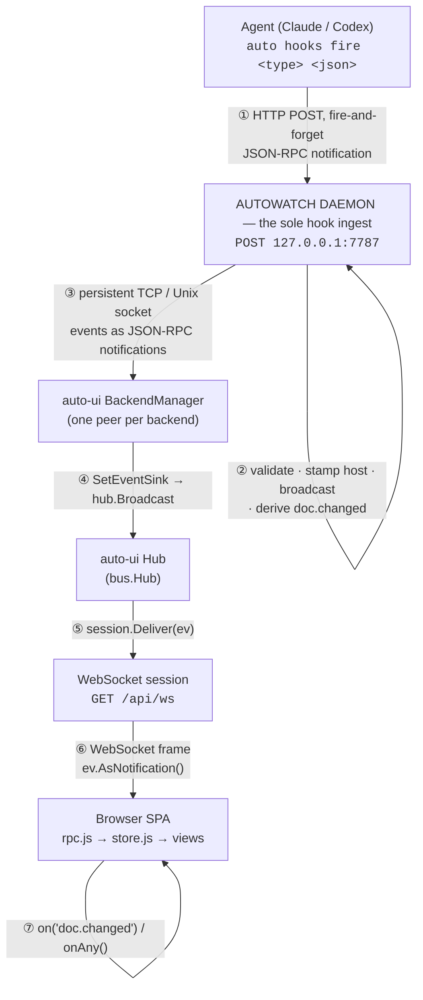
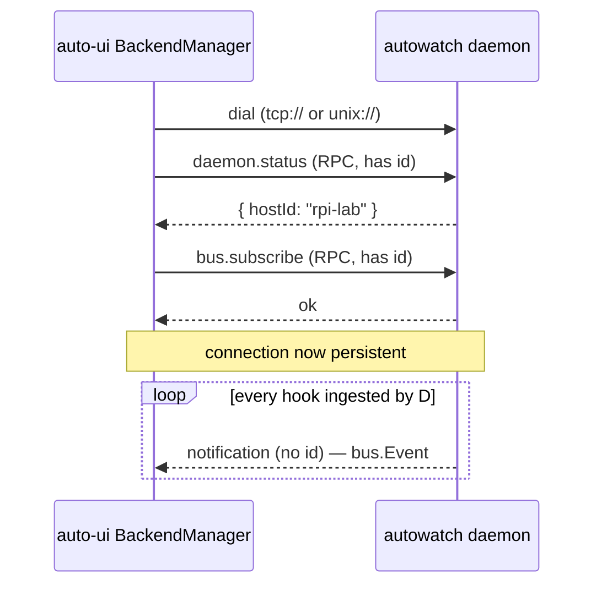
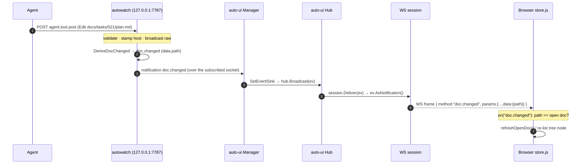

# How auto-ui Receives Hooks From Executing Agents

> **One-line summary:** auto-ui ingests **no hooks of its own**. Agents fire hooks
> into the **autowatch** daemon (the sole ingest); auto-ui is a pure proxy that
> *subscribes* to one or more autowatch backends over a persistent JSON-RPC socket,
> relays every event into an in-process hub, and pushes them to the browser SPA over
> a WebSocket.

This doc *shows* the flow with real source excerpts and the actual wire frames at
each boundary. Every code block is copied from the tree, with `file:line` anchors so
you can jump straight to it.

---

## 0. The shape, at a glance



The single most important fact: **the arrow into auto-ui points *out* from auto-ui.**
auto-ui dials autowatch and subscribes; hooks never arrive at auto-ui unsolicited.
This is the post-task-047 design — "autowatch is the sole hook ingest."

---

## 1. Ingest happens in **autowatch**, not auto-ui

An agent fires a hook via `auto hooks fire`, which does a one-shot, fire-and-forget
HTTP POST to the autowatch daemon on loopback. The handler validates the envelope,
stamps the authoritative host, broadcasts the raw event, then derives `doc.changed`
for registered projects and broadcasts those too.

`auto-watch/internal/rpcserver/ingest.go:75`:

```go
ev := frame.Params
if errs := ev.Validate(); len(errs) > 0 {
    writeIngestError(w, http.StatusBadRequest, -32602, "envelope validation failed")
    return
}

// Stamp the daemon's hostId (overwrite-always, D-40-3).
ev.Host = hostID

// Broadcast the validated event.
if hub != nil {
    hub.Broadcast(ev)

    // Derive doc.changed for registered projects.
    derived := bus.DeriveDocChanged(ev, regProvider())
    for i := range derived {
        hub.Broadcast(derived[i])
    }
}

w.WriteHeader(http.StatusNoContent)
```

Guard rails the handler enforces before any of that (`ingest.go:26-52`):

| Check | Failure |
|-------|---------|
| `POST` only | `405 Method Not Allowed` |
| Loopback remote addr (`127.0.0.1`, `::1`, `localhost`) | `403` |
| **No** browser `Origin` header (anti-CSRF) | `403` |
| `Content-Type: application/json` | `415` |
| Body ≤ 1 MiB | `400` |
| `jsonrpc == "2.0"` and `ev.Validate()` passes | `400` |

**The wire frame an agent POSTs** (JSON-RPC 2.0 notification — no `id`):

```json
{
  "jsonrpc": "2.0",
  "method": "agent.tool.post",
  "params": {
    "specversion": "1.0",
    "type": "agent.tool.post",
    "source": "auto/hooks/claude",
    "id": "a1b2c3d4e5f67890",
    "time": "2026-06-11T10:30:00Z",
    "project": "auto-stack",
    "worktree": "/home/user/src/auto-stack",
    "branch": "main",
    "data": { "tool": "Edit", "event": "PostToolUse",
              "paths": ["docs/tasks/021/plan.md"] }
  }
}
```

If that path matches `docs/**/*.md` in a registered project, autowatch emits a
**second**, derived event — `doc.changed` — with the changed path under `data.path`.
That derive site (`bus.DeriveDocChanged`) is now the **only** one in the system.

---

## 2. auto-ui subscribes as an RPC **client** — fail-fast without a backend

auto-ui never opens an ingest port. On `serve` it loads `~/.auto/ui/backends.json`
and **refuses to start with no backend** — it is a pure proxy with no local data.

A `backend.Manager` goroutine reconciles that config immediately, then every 5 s,
so `auto ui backends add/remove` takes effect without a restart
(`auto-ui/internal/backend/manager.go:159`):

```go
func (m *Manager) Run(ctx context.Context) error {
    ...
    m.Reconcile(ctx)                 // connect to each configured backend now

    ticker := time.NewTicker(interval) // ...and again every 5s
    for {
        select {
        case <-ctx.Done():
            m.closeAll()
            return ctx.Err()
        case <-ticker.C:
            m.Reconcile(ctx)         // pick up add/remove without restart
        }
    }
}
```

### The connect + subscribe handshake

For each configured URI the manager dials, learns the backend's authoritative
`hostId` via `daemon.status`, then calls `bus.subscribe` to register for the
broadcast relay (`manager.go:261`):

```go
netConn, err := m.dial(ctx, uri)              // tcp:// or unix://
...
peer := rpc.NewPeer(netConn, rpc.WithOnNotify(m.onNotify))
go peer.Serve(connCtx)                          // reader loop for inbound RPC

// ① learn who this backend is
raw, err := peer.Call(callCtx, "daemon.status", nil)
...
// ② register for the broadcast-all relay
relayDegraded := !m.subscribe(connCtx, peer)    // bus.subscribe

c.hostID = status.HostID
c.connected = true
c.relayDegraded = relayDegraded                 // usable for RPC even if relay failed
m.conns[uri] = c
```

```go
func (m *Manager) subscribe(connCtx context.Context, peer *rpc.Peer) bool {
    callCtx, callCancel := context.WithTimeout(connCtx, subscribeTimeout)
    defer callCancel()
    _, err := peer.Call(callCtx, "bus.subscribe", nil)   // parameterless, broadcast-all
    return err == nil
}
```

> A failed `bus.subscribe` is **degraded, not fatal**: the peer still serves proxied
> RPCs (`project.list`, `doc.get`), and the next reconcile retries the subscribe.



### Relayed events flow straight into the hub

Every inbound notification on a peer hits `onNotify`, which decodes the `bus.Event`
and hands it to the event sink (`manager.go:144`):

```go
func (m *Manager) onNotify(req rpc.Request) {
    var ev bus.Event
    if err := json.Unmarshal(req.Params, &ev); err != nil {
        return
    }
    holder, _ := m.eventSink.Load().(eventSinkHolder)
    fn := holder.fn
    if fn == nil {
        return                          // unset sink: drop silently (events are lossy)
    }
    fn(ev)
}
```

The server wires that sink to `hub.Broadcast` at startup (plus the debug ring), so a
relayed event becomes a hub broadcast:

```go
mgr.SetEventSink(func(ev bus.Event) {
    hub.Broadcast(ev)
    buf.record(ev)        // feeds /api/debug/recent
})
```

> **Why no dedup?** The task-045 transition-window `eventGate` is gone (task 047).
> With a single ingest path an event can no longer arrive by two routes, so there is
> nothing to dedup.

---

## 3. The hub fans out to browsers over WebSocket

Each browser holds one persistent WebSocket at `GET /api/ws`. On accept, the handler
creates a `session`, subscribes it to the hub, and starts a single write pump
(`auto-ui/internal/server/ws.go:26`):

```go
func handleWSWithHub(hub *bus.Hub, d *Dispatcher) http.HandlerFunc {
    return func(w http.ResponseWriter, r *http.Request) {
        c, err := websocket.Accept(w, r, nil)   // same-origin default
        ...
        s := newSession(c, ctx, cancel)
        unsub := hub.Subscribe(s)                // session becomes a broadcast sink
        defer unsub()

        go s.writePump(ctx)                      // sole writer
        s.readLoop(ctx, d)                       // inbound RPC calls
    }
}
```

The session implements `bus.Sink`. On broadcast the hub calls `Deliver`, which
serializes the event to a JSON-RPC notification and enqueues it
(`ws.go:68`):

```go
func (s *session) Deliver(ev bus.Event) {
    s.enqueue(s.ctx, ev.AsNotification())
}

func (s *session) enqueue(ctx context.Context, msg any) bool {
    select {
    case s.out <- msg:
        return true                  // queued
    case <-ctx.Done():
        return false
    default:
        s.cancel()                   // buffer full → drop slow client, never block
        return false
    }
}
```

> **Backpressure policy = drop-on-full.** The outbound buffer is 16 slots
> (`outboundBuffer = 16`). A client too slow to drain it gets its connection
> cancelled rather than stalling the server. Events are invalidations, not state —
> losing one is safe; the next list/get re-reads the truth.

---

## 4. The SPA routes frames by `id` vs `method`

The browser keeps a singleton WebSocket (`wss://` behind `tailscale serve`, `ws://`
on localhost). Each frame is either a **response** to one of our calls (has an `id`)
or a **server-pushed notification** (has a `method`) — `auto-ui/web/static/rpc.js:120`:

```js
sock.onmessage = (ev) => {
  const msg = JSON.parse(ev.data);

  // A message WITH an id is a response to one of our calls...
  if (msg.id !== undefined && msg.id !== null && pending.has(msg.id)) {
    const { resolve, reject } = pending.get(msg.id);
    pending.delete(msg.id);
    if (msg.error) reject(new Error(msg.error.message || "rpc error"));
    else resolve(msg.result);
    return;
  }
  // ...WITHOUT an id it is a server-pushed notification.
  if (msg.method) {
    recordEvent(msg.method, msg.params);                 // bounded debug ring
    for (const h of anyHandlers) h({ method: msg.method, params: msg.params }); // onAny
    const hs = notifyHandlers.get(msg.method);
    if (hs) for (const h of hs) h(msg.params);           // on("doc.changed", ...)
  }
};
```

**All bus subscriptions live in `store.js`** (views are presentational):

- `on("doc.changed", …)` — if the changed path is the open doc, re-fetch markdown /
  bump the iframe nonce; if it's a new or `.html` path, force a `doc.list` re-list so
  the node (and its `planning → executing` status pill) repaints.
- `onAny(…)` — **executor liveness**: record `(project, branch) → timestamp` for
  non-main branches and render `"Ns ago"`.

> ### ⚠️ THE GOTCHA — the changed path is at `ev.data.path`
> `Event.AsNotification` puts the whole envelope under JSON-RPC `params`. The envelope
> carries top-level `project`/`worktree`, but `path`/`abs_path`/`branch` live under
> **`data`**. The retired `doc.js` read `ev.path` (always `undefined`), so its live
> refresh never fired. `docevents.js` (`parseDocChanged` / `matchesDoc`) is now the
> single source of truth for reading the notification, and
> `TestHookIngest_DeriveDocChanged_RegisteredProject` pins the `data.path` shape so it
> can't silently regress.

**The frame the browser actually receives:**

```json
{
  "jsonrpc": "2.0",
  "method": "doc.changed",
  "params": {
    "specversion": "1.0",
    "type": "doc.changed",
    "source": "auto/bus/derive",
    "id": "...",
    "time": "2026-06-11T10:30:00Z",
    "project": "auto-stack",
    "host": "rpi-lab",
    "worktree": "/home/user/src/auto-stack",
    "data": {
      "path": "docs/tasks/021/plan.md",
      "abs_path": "/home/user/src/auto-stack/docs/tasks/021/plan.md",
      "branch": "main"
    }
  }
}
```

---

## 5. The "backends" concept

A **backend** is one autowatch daemon — local or remote. Config lives at
`~/.auto/ui/backends.json` as a list of `{uri, name, hostId}`:

```json
{
  "backends": [
    { "uri": "unix:///home/user/.auto/watch/rpc.sock", "name": "local",  "hostId": "rpi-lab" },
    { "uri": "tcp://192.168.1.100:7788",               "name": "ci",     "hostId": "ci-server" }
  ]
}
```

`auto ui backends add <uri>` probes the backend before saving — it calls
`daemon.status` (reachability + learn `hostId`) and `project.list` (confirm it's a
real backend), rejects duplicate URIs / hostIds, and requires `unix://` or `tcp://`.

auto-ui connects to **all** configured backends concurrently and aggregates
`project.list` across them, tagging each project with its source `host`
(`internal/server/project_aggregate.go`). That's how one SPA tree shows projects from
multiple machines without ambiguity — UI identity is `(hostId, projectId)` end to end.
A backend that's down is **skipped**, not fatal: the list returns partial results.

---

## 6. End-to-end, one worked example



**Result:** an agent edits `docs/tasks/021/plan.md` in a worktree; a second later the
explorer pane repaints that doc — no polling, no file watcher in auto-ui, just the
one `doc.changed` invalidation riding the bus.

---

## Reference — key files

| Stage | File | Anchor |
|-------|------|--------|
| Hook ingest (sole) | `auto-watch/internal/rpcserver/ingest.go` | `HookIngest` @ `:24`, derive @ `:89` |
| Subscribe / relay | `auto-ui/internal/backend/manager.go` | `connect` @ `:261`, `subscribe` @ `:347`, `onNotify` @ `:144`, `Run` @ `:159` |
| Server wiring | `auto-ui/internal/server/server.go` | `SetEventSink` |
| Browser push | `auto-ui/internal/server/ws.go` | `handleWSWithHub` @ `:26`, `Deliver` @ `:68` |
| SPA client | `auto-ui/web/static/rpc.js` | `onmessage` @ `:120` |
| SPA subscriptions | `auto-ui/web/static/store.js`, `docevents.js` | `on("doc.changed")`, `parseDocChanged` |
| Backends config/CLI | `auto-ui/internal/config/backends.go`, `auto-ui/internal/cli/backends.go` | — |
| Multi-host aggregation | `auto-ui/internal/server/project_aggregate.go` | `aggregateProjectList`, `backendsList` |
| Wire spec | `docs/auto-bus-spec.md` | CloudEvents envelope, event registry |

## Design invariants worth remembering

1. **One ingest path** — autowatch only. auto-ui has zero local ingest (task 047).
2. **One derive site** — `bus.DeriveDocChanged` in autowatch. No second-pass derive.
3. **auto-ui dials out** — it's an RPC *client* of each backend, subscribing via `bus.subscribe`.
4. **At-most-once, lossy** — no acks, no replay. Events are invalidations, not state.
5. **Drop-on-full** — 16-slot buffers on both the RPC peer and WS session; slow consumers get dropped, never block.
6. **Fail-fast without a backend** — `serve` exits if `backends.json` is empty.
7. **Identity is `(hostId, projectId)`** — host disambiguates everywhere, even with one backend.
