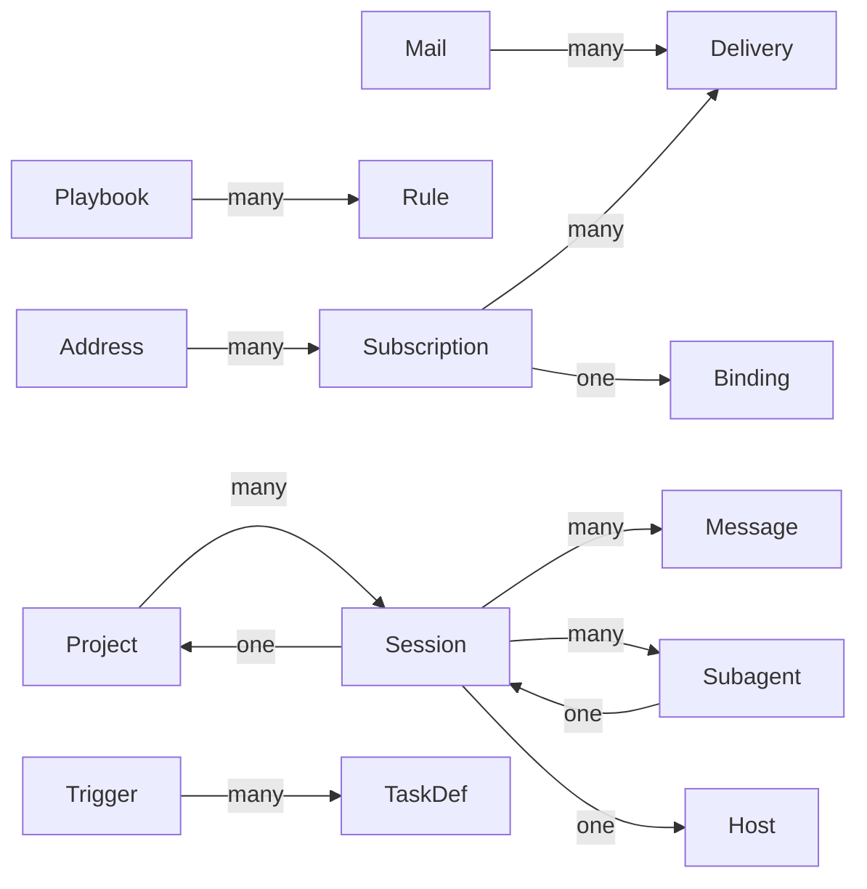

# Ubiquitous Language

## Domain at a glance

<!-- ER-DIAGRAM:START (generated by glossary.py — do not edit by hand) -->

<!-- ER-DIAGRAM:END -->

The canonical vocabulary for auto-stack. When a concept below has a canonical term, use it
everywhere — chat, code, comments, commit messages — and treat the words under `_Avoid_` as
wrong. One word per concept, shared by people, code, and agents.

## Session Data

**Session**:
A complete coding agent interaction from start to finish, across one or more tools (Claude, Codex, etc.). The primary unit of analysis in the platform.
_Avoid_: Conversation, chat, transcript, thread
_Has_: many Messages, many Subagents, one Host, one Project

**Subagent**:
A Session spawned by another Session to handle a subtask. Identified by a parent Session ID and a name.
_Avoid_: Child session, nested session, sub-session
_Has_: one Session

**Message**:
A single role-tagged exchange within a Session — one of user, assistant, tool, system, or thinking.
_Avoid_: Turn, entry, row, line

**Host**:
The machine where Sessions are recorded. Identified by a stable host ID persisted in `~/.auto/host.json`.
_Avoid_: Machine, server, node, instance

**Project**:
A registered repository with cross-host identity via its git remote. One Project can have many Sessions across many Hosts.
_Avoid_: Workspace, repo, repository, codebase
_Has_: many Sessions

## Reflection

**Rule**:
A distilled, reusable directive extracted from past Session analysis. Has a lifecycle (draft, confirmed, stale) and a type (hard or soft).
_Avoid_: Guideline, recommendation, lesson, learning, insight

**Observation**:
An evidence-grounded finding from a single Session — a correction, pattern, gap, or incident — that may later be consolidated into a Rule.
_Avoid_: Finding, note, issue, flag

**Playbook**:
A versioned snapshot of all Rules for a repository. The human-reviewable artifact that agents retrieve from and teams curate.
_Avoid_: Rule set, rule collection, rulebook, knowledge base
_Has_: many Rules

## Automation

**Event**:
A typed, timestamped record carrying structured data and provenance. Qualified by context: Bus Event (CloudEvents pub/sub envelope), Reflect Event (append-only rule lifecycle log), or Watch Event (trigger/task audit record).
_Avoid_: Notification, alert, hook

**TaskDef**:
A named unit of automatable work defined in a Project's watch configuration — either a bash command or a Claude prompt.
_Avoid_: Task, job, action, step

**Trigger**:
A named condition that fires and launches one or more TaskDefs — a cron schedule or a file glob pattern.
_Avoid_: Watcher, listener, hook, scheduler
_Has_: many TaskDefs

## Skills

**Skill**:
A named, versioned, distributable agent capability — a reusable prompt, workflow, or reference guide that can be installed, synced, and triggered by agents.
_Avoid_: Plugin, extension, template, command

## Code Intelligence

**Context Pack**:
A curated bundle of source files assembled by auto-graph for an agent — includes file contents, reading order, inter-file relationships, guidance, and token budget accounting.
_Avoid_: Pack, context bundle, file set, context window

## Mail

**Mail**:
The stored unit of an addressed, durable message between agents on a Host — immutable once sent, and retired only by an explicit ack.
_Avoid_: Message (that word already names a Session exchange), email, letter, note
_Has_: many Deliveries

**Address**:
A virtual, free-form name a Mail is sent to. Carries no physical identity — no Host, Session, pane or process is derivable from it.
_Avoid_: Mailbox, queue, topic, channel, inbox
_Has_: many Subscriptions

**Subscription**:
A durable reader of an Address, holding its own cursor and its own ack state.
_Avoid_: Subscriber, consumer, listener, reader
_Has_: many Deliveries, one Binding

**Delivery**:
The per-Subscription copy of one Mail together with its read and ack state.
_Avoid_: Receipt, copy, inbox item

**Binding**:
The current physical target of a Subscription, recorded as an opaque `(manager, target)` pair.
_Avoid_: Pane, session link, attachment, route
