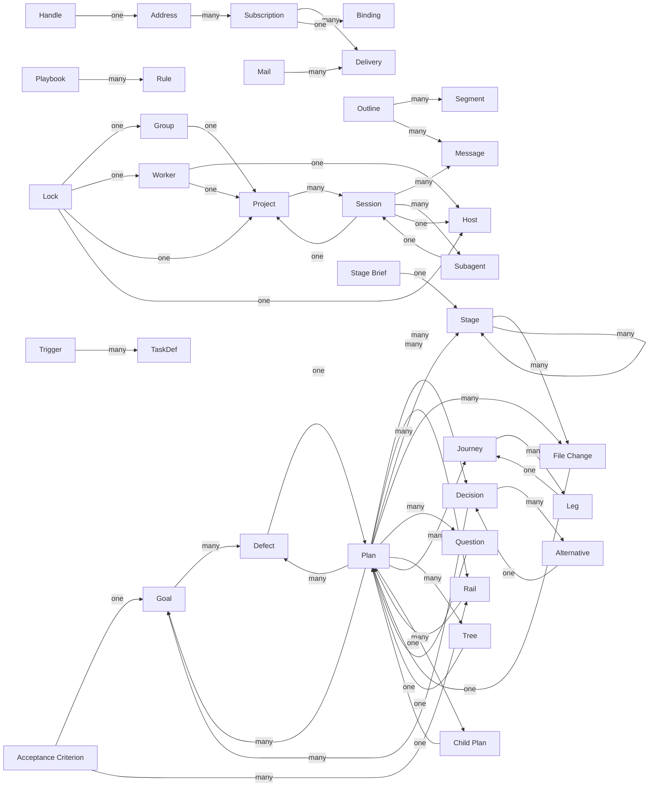

# Ubiquitous Language

## Domain at a glance

<!-- ER-DIAGRAM:START (generated by glossary.py — do not edit by hand) -->

```mermaid
flowchart LR
    Acceptance_Criterion["Acceptance Criterion"]
    Address["Address"]
    Alternative["Alternative"]
    Binding["Binding"]
    Child_Plan["Child Plan"]
    Decision["Decision"]
    Defect["Defect"]
    Delivery["Delivery"]
    File_Change["File Change"]
    Goal["Goal"]
    Group["Group"]
    Handle["Handle"]
    Host["Host"]
    Journey["Journey"]
    Leg["Leg"]
    Lock["Lock"]
    Mail["Mail"]
    Message["Message"]
    Outline["Outline"]
    Plan["Plan"]
    Playbook["Playbook"]
    Project["Project"]
    Question["Question"]
    Rail["Rail"]
    Rule["Rule"]
    Segment["Segment"]
    Session["Session"]
    Stage["Stage"]
    Stage_Brief["Stage Brief"]
    Subagent["Subagent"]
    Subscription["Subscription"]
    TaskDef["TaskDef"]
    Tree["Tree"]
    Trigger["Trigger"]
    Worker["Worker"]
    Session -->|many| Message
    Session -->|many| Subagent
    Session -->|one| Host
    Session -->|one| Project
    Subagent -->|one| Session
    Project -->|many| Session
    Outline -->|many| Segment
    Outline -->|many| Message
    Playbook -->|many| Rule
    Trigger -->|many| TaskDef
    Mail -->|many| Delivery
    Address -->|many| Subscription
    Subscription -->|many| Delivery
    Subscription -->|one| Binding
    Handle -->|one| Address
    Lock -->|one| Group
    Lock -->|one| Worker
    Lock -->|one| Project
    Lock -->|one| Host
    Group -->|one| Project
    Worker -->|one| Host
    Worker -->|one| Project
    Plan -->|many| Goal
    Plan -->|many| Decision
    Plan -->|many| Rail
    Plan -->|many| Defect
    Plan -->|many| Stage
    Plan -->|many| File_Change
    Plan -->|many| Question
    Plan -->|many| Tree
    Plan -->|many| Journey
    Plan -->|many| Child_Plan
    Child_Plan -->|one| Plan
    Goal -->|many| Defect
    Acceptance_Criterion -->|one| Goal
    Acceptance_Criterion -->|many| Rail
    Decision -->|many| Alternative
    Decision -->|many| Goal
    Alternative -->|one| Decision
    Rail -->|one| Plan
    Defect -->|one| Plan
    Stage -->|many| File_Change
    Stage -->|many| Stage
    File_Change -->|one| Plan
    Journey -->|many| Leg
    Leg -->|one| Journey
    Question -->|one| Plan
    Tree -->|one| Plan
    Stage_Brief -->|one| Stage
```
<!-- ER-DIAGRAM:END -->

The canonical vocabulary for auto-stack. When a concept below has a canonical term, use it
everywhere — chat, code, comments, commit messages — and treat the words under `_Avoid_` as
wrong. One word per concept, shared by people, code, and agents.

## Session Data

**Session**:
A complete coding agent interaction from start to finish, across one or more tools (Claude, Codex, etc.). The primary unit of analysis in the platform.
_Avoid_: Conversation, chat, transcript, thread
_Has_: many Messages, many Subagents, one Host, one Project

**Subagent**:
A Session spawned by another Session to handle a subtask. Identified by a parent Session ID and a name.
_Avoid_: Child session, nested session, sub-session
_Has_: one Session

**Message**:
A single role-tagged exchange within a Session — one of user, assistant, tool, system, or thinking.
_Avoid_: Turn, entry, row, line

**Host**:
The machine where Sessions are recorded. Identified by a stable host ID persisted in `~/.auto/host.json`.
_Avoid_: Machine, server, node, instance

**Project**:
A registered repository with cross-host identity via its git remote. One Project can have many Sessions across many Hosts.
_Avoid_: Workspace, repo, repository, codebase
_Has_: many Sessions

**Outline**:
The bodies-free, navigable map of a Session — the Subagent spine, each node's timeline cut into Segments, and per-Message leaves addressable for full-fidelity expansion. What `auto search session outline` returns. An Outline never carries message bodies; it carries the structure and the commands that recover them.
_Avoid_: Tree (for a Session map), map, skeleton, summary
_Has_: many Segments, many Messages

**Segment**:
A contiguous run of one Session node's timeline, cut at a deterministic structural boundary (subagent dispatch, tool-failure transition, todo/bead marker, wall-clock gap, tool-kind change) and collapsed to a one-line label plus its `message_index` range and counts. Identified as `<session_id>#s<n>`.
_Avoid_: Phase (of a Session timeline), chunk, block, step, span

## Reflection

**Rule**:
A distilled, reusable directive extracted from past Session analysis. Has a lifecycle (draft, confirmed, stale) and a type (hard or soft).
_Avoid_: Guideline, recommendation, lesson, learning, insight

**Observation**:
An evidence-grounded finding from a single Session — a correction, pattern, gap, or incident — that may later be consolidated into a Rule.
_Avoid_: Finding (from a Session), note, issue, flag

**Playbook**:
A versioned snapshot of all Rules for a repository. The human-reviewable artifact that agents retrieve from and teams curate.
_Avoid_: Rule set, rule collection, rulebook, knowledge base
_Has_: many Rules

## Automation

**Event**:
A typed, timestamped record carrying structured data and provenance. Qualified by context: Bus Event (CloudEvents pub/sub envelope), Reflect Event (append-only rule lifecycle log), or Watch Event (trigger/task audit record).
_Avoid_: Notification, alert, hook

**TaskDef**:
A named unit of automatable work defined in a Project's watch configuration — either a bash command or a Claude prompt.
_Avoid_: Task (in watch configuration), job, action, step

**Trigger**:
A named condition that fires and launches one or more TaskDefs — a cron schedule or a file glob pattern.
_Avoid_: Watcher, listener, hook, scheduler
_Has_: many TaskDefs

## Skills

**Skill**:
A named, versioned, distributable agent capability — a reusable prompt, workflow, or reference guide that can be installed, synced, and triggered by agents.
_Avoid_: Plugin, extension, template, command

## Code Intelligence

**Context Pack**:
A curated bundle of source files assembled by auto-graph for an agent — includes file contents, reading order, inter-file relationships, guidance, and token budget accounting.
_Avoid_: Pack, context bundle, file set, context window

## Mail

**Mail**:
The stored unit of an addressed, durable message between agents on a Host — immutable once sent, and retired only by an explicit ack.
_Avoid_: Message (that word already names a Session exchange), email, letter, note
_Has_: many Deliveries

**Address**:
A virtual, free-form name a Mail is sent to. Carries no physical identity — no Host, Session, pane or process is derivable from it.
_Avoid_: Mailbox, queue, topic, channel, inbox
_Has_: many Subscriptions

**Subscription**:
A durable reader of an Address, holding its own cursor and its own ack state.
_Avoid_: Subscriber, consumer, listener, reader
_Has_: many Deliveries, one Binding

**Delivery**:
The per-Subscription copy of one Mail together with its read and ack state.
_Avoid_: Receipt, copy, inbox item

**Handle**:
A relative alias for an Address, written with a leading `#`, resolved at send time and never stored — the stored envelope always carries the resolved absolute Address. Today there is exactly one: `#parent`, the supervisor of an in-process Subagent.
_Avoid_: Alias, shortcut, relative address, magic address
_Has_: one Address

**Binding**:
The current physical target of a Subscription, recorded as an opaque `(manager, target)` pair.
_Avoid_: Pane, session link, attachment, route

## Locks

**Lock**:
A serial-update reservation on one Group of a Project, held by exactly one Worker at a time and recorded in the host-global lock store. Taken explicitly with `auto lock take`, freed by `release`, or recovered by a merge-verified `clear` or lost-liveness reclaim — never by a TTL.
_Avoid_: Mutex, reservation, claim, hold, file lock
_Has_: one Group, one Worker, one Project, one Host

**Group**:
A named, described set of files (one or more repo-relative globs) declared in a Project's `.auto/lock/settings.json` that must be edited serially. The lockable unit — a Lock covers the whole Group, never individual files.
_Avoid_: Lock set, glob set, file group, pattern
_Has_: one Project

**Worker**:
The identity that holds a Lock, resolved through a chain visible to both the CLI and the hook: an explicit `AUTO_LOCK_WORKER` override, else the linked git worktree branch, else the tmux pane or NTM label on a shared checkout. Never keyed on a Session id, which only the hook can see.
_Avoid_: Owner, editor, agent identity, holder key
_Has_: one Host, one Project

## Planning

**Plan**:
The structured record of intended work — typed items and typed relationships held in one `graph.json` under `.auto/plan/plans/NNN-name/` — whose kind is either task or epic. What `auto plan` creates, changes, lints and reads.
_Avoid_: Task (only a Plan's kind, never the unit), spec, ticket, plan doc
_Has_: many Goals, many Decisions, many Rails, many Defects, many Stages, many File Changes, many Questions, many Trees, many Journeys, many Child Plans

**Child Plan**:
An epic Plan's reference to one of the Plans that delivers part of it. The child links back to the epic only by qualified reference and never copies the epic's text.
_Avoid_: Subtask, sub-plan, child task
_Has_: one Plan

**Goal**:
One outcome a Plan commits to, stated in a single line. Proven by Acceptance Criteria and constrained by Decisions.
_Avoid_: Objective, aim, outcome, requirement
_Has_: many Defects

**Acceptance Criterion**:
A given/when/then statement that proves exactly one Goal, carrying the reproducible command (or manual check) that verifies it.
_Avoid_: Test case, success criterion, done condition
_Has_: one Goal, many Rails

**Decision**:
A settled choice that constrains Goals or Acceptance Criteria, recorded with why it was made and the Alternatives it rejected.
_Avoid_: Choice, resolution, ruling
_Has_: many Alternatives, many Goals

**Alternative**:
An option a Decision considered and rejected, with the reason it was rejected and what it would have broken.
_Avoid_: Option, rejected option, variant
_Has_: one Decision

**Rail**:
A constraint an epic Plan places on every Child Plan, honoured by reference and discharged by Acceptance Criteria.
_Avoid_: Guard rail, guardrail, invariant, constraint
_Has_: one Plan

**Defect**:
A known problem in existing code that a Plan sets out to fix.
_Avoid_: Finding (in a Plan), bug report, issue
_Has_: one Plan

**Stage**:
An ordered slice of a Plan's work that leaves the system shippable, with its steps, the File Changes it touches and its commit message.
_Avoid_: Phase (in a Plan), milestone, step, sprint
_Has_: many File Changes, many Stages

**File Change**:
One planned addition, edit or deletion of a repo file, with the reason for it.
_Avoid_: Planned file, file edit, diff
_Has_: one Plan

**Journey**:
An end-to-end path an actor takes through the system that an epic Plan delivers, cut into Legs.
_Avoid_: User story, flow, scenario
_Has_: many Legs

**Leg**:
One actor-and-action step of a Journey, delivered by a Child Plan.
_Avoid_: Journey step, hop, beat
_Has_: one Journey

**Question**:
An open or answered point a Plan cannot settle alone, with a recommended answer and, once resolved, the answer given. An open Question gates the Plan.
_Avoid_: TBD, open issue, unknown
_Has_: one Plan

**Tree**:
Structured text in show-me notation — a call, file, dependency or pseudocode tree with a `+ - ~` gutter — attached to a Plan to show shape at a glance.
_Avoid_: Diagram, sketch, ASCII art
_Has_: one Plan

**Stage Brief**:
Everything an executing agent needs for one Stage, derived from the Plan: its steps, the File Changes it touches, the Acceptance Criteria it covers, and the Decisions, Rails and Questions that bear on them.
_Avoid_: Context Pack (that names auto-graph's file bundle), stage pack, handoff
_Has_: one Stage
