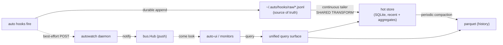

# Live Tier Architecture

## The tension

As we build more monitoring and analytics on the stack, we keep wanting to ask
questions like *"what is job X doing right now?"* and *"which sessions are in
flight?"*. The only queryable store we have is parquet, produced by `auto etl`,
which runs as a periodic batch and is therefore minutes-to-hours stale. The
temptation is to stand up a *separate* live data layer for monitoring — at which
point we'd be recreating data and logic that auto-etl already owns.

This note argues that the tension is really **two problems wearing one coat**,
and that separating them dissolves the conflict.

## Two problems, not one

### Problem 1 — Latency (a real, unavoidable format mismatch)

Parquet + a periodic ETL is a *cold analytical* store. It is the right shape for
"6 months of history, fast columnar scans" and the wrong shape for "what is
happening now," for two independent reasons:

- Parquet hates small, frequent appends — running ETL every minute produces the
  small-file problem and constant file rewrites/compaction.
- Monitoring an *ongoing* job means **upserting mutable, evolving rows** ("session
  started… 3 tools… still running… done"). That is an OLTP / row-store access
  pattern. Append-only columnar cannot represent in-progress state cheaply.

So if we want second-level freshness, a **hot tier is unavoidable**. This is not
a defect in the current design; it is a format mismatch. Parquet stays; it just
isn't the thing you point live queries at.

### Problem 2 — Duplication (the one we actually fear) — and it already exists

The worry is "we'll recreate what auto-etl covers." That duplication is already
happening, in two places:

- **Transform duplication.** `HookIngest`
  (`auto-watch/internal/rpcserver/ingest.go`) derives `doc.changed` inline, while
  ETL derives its own normalized fields when it writes parquet
  (`auto-etl/internal/model`). Two transforms over the same source events, free
  to drift.
- **State-accumulation duplication.** This is the subtle, more dangerous one.
  Today auto-ui (and every future monitor) subscribes to the in-memory bus
  (`auto-shared/bus/hub.go`) and **rebuilds its own materialized state** from the
  raw event stream. Every new consumer that wants "current state" re-derives it
  from scratch off the bus. *That* is the recreating-data trap — not parquet, but
  N consumers each privately reconstructing state ETL already knows how to
  compute.

## The reframe that dissolves it

> **One schema, one transform, many materializations.**
> **The bus notifies; it does not store. State lives in exactly one hot store;**
> **consumers query it.**

A hot tier is **not** "recreating ETL data" if it is the *same data, same schema,
same transform* — just at a different latency and in a row format before
compaction. It only becomes a parallel data product if it grows its own divergent
logic. So the entire discipline is: keep the transform single, keep state
centralized.

### Roles, made explicit

| Component | Role | Latency | Mutability |
|-----------|------|---------|------------|
| **Bus** (`bus.Hub`) | Push / "something changed, come look" — reactive UI, triggers | ms | n/a (ephemeral) |
| **Hot store** | "What is true *now*" — recent window, indexed, upsertable | seconds | mutable |
| **Parquet** | "What was true historically" — analytical scans | batch | immutable |
| **Query surface** | Unions hot + cold so callers never know which tier answered | — | — |

The bus stops being something you *query*. It is the notification channel that
tells a consumer *when* to re-query the hot store. Query state comes from the hot
store; history comes from parquet; one surface merges them.

This is Lambda/Kappa, kept **local-first and embedded** — appropriate to our
scale (~1 GB / 6 months, single/few hosts). No Kafka, no external streaming infra.

## Design principles

1. **The producer-side durable JSONL append is the source of truth and does not
   change.** It is correctly decoupled from the daemon being up — if the daemon
   is down, events are still captured. Everything downstream is a materialization
   of this log.
2. **There is exactly one transform.** Normalize + derive lives in a single Go
   package imported by both the live path and the batch path. They differ only in
   their *sink*, never in their *logic*.
3. **There is exactly one hot store.** Consumers do not each accumulate state off
   the bus. They query the hot store. The bus only tells them when to re-query.
4. **"Live" vs "batch" is a flush parameter, not an architecture.** In the end
   state, writing parquet is *compaction of the hot tier*, not a separate scan.
5. **One query surface.** Tooling asks one place; tiering is an implementation
   detail. This is what structurally prevents a separate monitoring data stack
   from ever being built.

## Implementation path (least- to most-invasive)

### Step 1 — Extract the transform into one shared package *(do this regardless)*

Pull normalize + derive (the `doc.changed` logic and friends) into a package that
*both* `HookIngest` and ETL import. They differ only in their sink. Cheapest
possible win, kills transform drift, and is the prerequisite for everything else.
Even if we do nothing else, this removes one half of the duplication today.

### Step 2 — Add a hot tier fed by a continuous tailer

Turn ETL's batch into a long-running consumer that tails the JSONL append log. It
already has offset cursors (`~/.auto/etl/hooks/sync-state.json`) — reuse them, but
trigger on file-change instead of cron. Apply the shared transform and **upsert
into a small embedded SQLite DB** holding recent state + live aggregates
(sessions-in-flight, last-N events per session, counters).

- **Deps constraint:** prefer pure Go (project guidance: minimal runtime deps).
  Use `modernc.org/sqlite` (pure Go), **not** DuckDB (CGO).

### Step 3 — Unified query surface that merges hot + cold

`auto search` exposes one API; under the hood it unions the SQLite hot store
(recent) with the parquet glob (historical). Monitors and the CLI never know the
tiering exists.

- DuckDB would give this union for free (it reads parquet natively) — worth a look
  *only if* we relax the pure-Go rule. Otherwise hand-roll the merge with the
  existing pure-Go parquet reader.

### Step 4 — North star: ETL becomes a flush, not a job

One streaming process is the spine. It maintains the hot store continuously, and
"writing parquet" becomes periodic **compaction** of the hot tier (triggered by
size / time / row-count). Latency stops being an architectural property and
becomes a single flush parameter. The hot store doubles as the live-query layer
*and* the parquet write buffer, so there is one write path and the "batch vs live"
distinction disappears.

Treat Step 4 as the direction we converge on, not a big-bang rewrite.

## What this explicitly avoids

- A second, monitoring-specific datastore with its own schema and ingest.
- Each consumer rebuilding materialized state from the raw bus stream.
- Two transforms (daemon-derive vs ETL-derive) drifting apart.
- Trying to make parquet do live, mutable, in-progress state (it can't, cheaply).

## Open questions

- **Hot-store retention window.** How long does "recent" live in SQLite before
  compaction prunes it (24h? until flushed to parquet)? Drives memory/disk sizing.
- **Compaction trigger.** Time-based, size-based, row-count, or hybrid — and does
  it block reads during the flush?
- **Multi-host.** The hot store is per-host. Do live monitoring queries need to
  span hosts, or is per-host live + parquet-for-cross-host-history sufficient?
- **Schema unification.** Can the hot row model and the parquet column model share
  one schema definition (e.g. generated from `auto-etl/internal/model`) so the
  union in Step 3 is mechanical rather than hand-mapped?
- **Backfill / replay.** On daemon restart, does the tailer rebuild hot state by
  replaying the tail of the JSONL log from a checkpoint?
